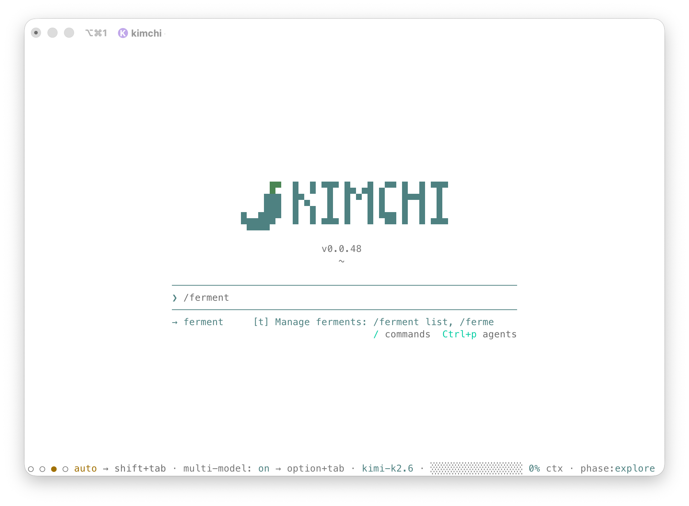

<div align="center">

<a href="https://kimchi.dev"></a>

# kimchi

[](https://github.com/getkimchi/kimchi/actions)

[](https://www.typescriptlang.org)
[](LICENSE)
[](https://discord.com/invite/getkimchi)
[](https://x.com/kimchi_dev)
[](https://www.linkedin.com/company/kimchi-dev/)

**A multi-model coding agent CLI for your terminal.**

Kimchi connects to a fleet of LLMs and automatically delegates each task to the model best suited for the job — orchestration, planning, building, reviewing, or exploration. Projects survive across sessions via [Ferment](#ferment), a cross-session project mode with deterministic state recovery.

[Quick start](#quick-start) · [Features](#features) · [Multi-model orchestration](#multi-model-orchestration) · [Ferment](#ferment) · [Development](#development) · [Docs](#docs)

</div>

---

## Quick start

### Install

**Homebrew (macOS / Linux):**

```bash
brew install getkimchi/tap/kimchi
```

**Install script:**

```bash
curl -fsSL https://github.com/getkimchi/kimchi/releases/latest/download/install.sh | bash
```

### Configure & run

```bash
kimchi setup   # one-time interactive setup
kimchi         # launch the coding agent
```

Run `kimchi --help` for all subcommands and flags.

> [!TIP]
> On first run, kimchi can migrate your MCP servers and skills from Claude Code or OpenCode. You'll see a one-shot prompt if anything is migratable.

---

## Features

| Feature | What it does |
|---------|-------------|
| **Multi-model orchestration** | Classifies every task and delegates it to the right model — heavy models for architecture, fast models for exploration. [Details](#multi-model-orchestration) |
| **Ferment** | Multi-session project mode with phases, steps, and automatic cross-session recovery. [Details](#ferment) |
| **MCP integration** | Connect to MCP servers for external tools (filesystem, GitHub, web search, etc.). |
| **Tagging** | Tag every LLM request for cost attribution and usage tracking. |
| **Remote teleport** | Session-multiplex across remote sandboxes without restarting kimchi. |
| **Token optimization (RTK)** | Optional output compression (60–90% reduction) for bash tool calls. |
| **Agent migration** | One-shot import of MCP servers and skills from Claude Code / OpenCode. |
| **IDE mode (ACP)** | JSON-RPC over stdio for editor integration. |

---

## Multi-model orchestration

Kimchi does not run everything on one model. Each task is classified and routed to a role-specific model pool:

| Role | Default | Purpose |
|------|---------|---------|
| **Orchestrator** | `kimi-k2.6` | Main loop, task classification, delegation |
| **Planner** | `kimi-k2.6` | Architecture, specs, interface design |
| **Builder** | `minimax-m2.7` | Code implementation |
| **Reviewer** | `kimi-k2.6` / `minimax-m2.7` | Code review, verification |
| **Explorer** | `kimi-k2.6` / `nemotron-3-super-fp4` | Codebase exploration, research |

Switch models interactively with `ctrl+p` or `/model`. Toggle between single-model and multi-model mode on the fly.

Configure role assignments in `~/.config/kimchi/harness/settings.json`:

```json
{
  "modelRoles": {
    "builder": ["kimchi-dev/minimax-m2.7", "anthropic/claude-sonnet-4-5"],
    "reviewer": "anthropic/claude-sonnet-4-5"
  }
}
```

> [!NOTE]
> The orchestrator picks the best model from each pool based on the task's complexity classification.

---

## Ferment

Ferment is kimchi's project mode for long-running, multi-session work. Instead of starting from scratch every chat, Ferment persists a structured plan and resumes exactly where you left off.

```bash
kimchi --ferment "Build a Redis clone"
```

Inside a session:

```
/ferment new "Build a Redis clone"   # create
/ferment auto                         # automated continuation
/ferment progress                     # navigate phases & steps
```

**How it works:**
- **Ferment** — the project ("Build a Redis clone")
- **Phase** — a milestone (e.g. "Wire protocol", "Data structures")
- **Step** — a concrete task (e.g. "Implement RESP parser")
- **Decision** — an architectural choice recorded for posterity
- **Memory** — conventions, gotchas, patterns discovered during work

State is persisted under `.kimchi/ferments/`. Every mutation is an append-only event with pre/post state hashes, enabling full auditability and deterministic recovery.

```bash
# Day 1: work, crash, terminal closes
# Day 2: re-run `kimchi --ferment "Build a Redis clone"` → resumes exactly where it stopped
```

> [!NOTE]
> For full documentation see [`docs/ferment.md`](docs/ferment.md).

---

## Configuration

### API key

Resolved in order:
1. `KIMCHI_API_KEY` environment variable
2. `~/.config/kimchi/config.json` field `api_key`

Run `kimchi setup` for interactive first-time configuration.

### Tags

Track usage and cost with `key:value` tags:

```bash
/tags add project:api team:backend
```

Static tags via `KIMCHI_TAGS="team:backend,project:api"`. Auto-tags (`model:`, `phase:`) are added to every request.

### HTTP proxy

Kimchi respects `HTTP_PROXY` / `HTTPS_PROXY`.

### Hooks

Add custom Bash command hooks in `~/.config/kimchi/harness/hooks/bash/` (global) or `.kimchi/hooks/bash/` (project). See [`docs/hooks.md`](docs/hooks.md) for the protocol.

---

## Development

### Prerequisites

- Node.js 22 (LTS)
- [Bun](https://bun.sh/)
- [corepack](https://nodejs.org/api/corepack.html) enabled (`corepack enable`)
- pnpm (installed via corepack)

### Setup

```bash
./scripts/dev-startup.sh   # checks deps, installs, copies resources, starts dev
```

Or manually:

```bash
git clone git@github.com:getkimchi/kimchi.git
cd kimchi
corepack enable
pnpm install
```

### Commands

| Command | Description |
|---------|-------------|
| `pnpm run build` | Compile to `dist/` and copy assets |
| `pnpm run dev` | Run CLI locally via Bun |
| `pnpm run check` | Biome lint + TypeScript type check |
| `pnpm run lint:fix` | Biome lint with auto-fix |
| `pnpm run test` | Unit tests (vitest) |
| `pnpm run test:smoke` | End-to-end smoke tests |

### Project structure

```
src/
  entry.ts              -- Entry point
  cli.ts                -- CLI logic & harness initialization
  commands/             -- CLI subcommands
  extensions/           -- Agent extensions
    agents/             -- Subagent system
    orchestration/      -- Task classification & delegation
    ferment/            -- Ferment lifecycle tools & UI
    mcp-adapter/        -- MCP server integration
  modes/
    interactive/        -- TUI harness
    acp/                -- JSON-RPC over stdio (IDE)
    teleport/           -- Remote session multiplexing
  agent-discovery/      -- Migration from other coding agents
  ferment/              -- Ferment state machine & event store
```

---

## Benchmarking

The `benchmark/` directory contains quality and performance tooling:

| Suite | What it does | Read more |
|-------|-------------|-----------|
| **Manual benchmarks** | Predefined tasks against different models | [`benchmark/manual/README.md`](benchmark/manual/README.md) |
| **terminal-bench-2** | 89-task [terminal-bench](https://www.harborframework.com/) suite in Docker | [`benchmark/terminal-bench-2/README.md`](benchmark/terminal-bench-2/README.md) |
| **Session audit** | Audit completed sessions for phase discipline, quality, cost | [`benchmark/audit-session/README.md`](benchmark/audit-session/README.md) |

---

## Docs

- [`docs/ferment.md`](docs/ferment.md) — Ferment project mode
- [`docs/ferment-storage-schema.md`](docs/ferment-storage-schema.md) — Ferment state & event format
- [`docs/hooks.md`](docs/hooks.md) — Bash hook protocol
- [`docs/teleport.md`](docs/teleport.md) — Remote teleport
- [`AGENTS.md`](AGENTS.md) — Agent guidelines for kimchi-dev contributors
