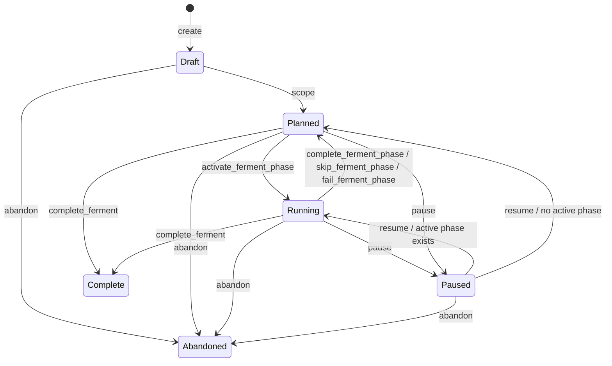
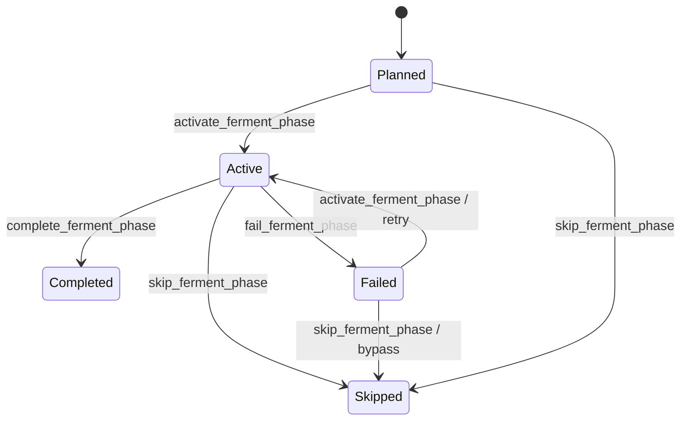
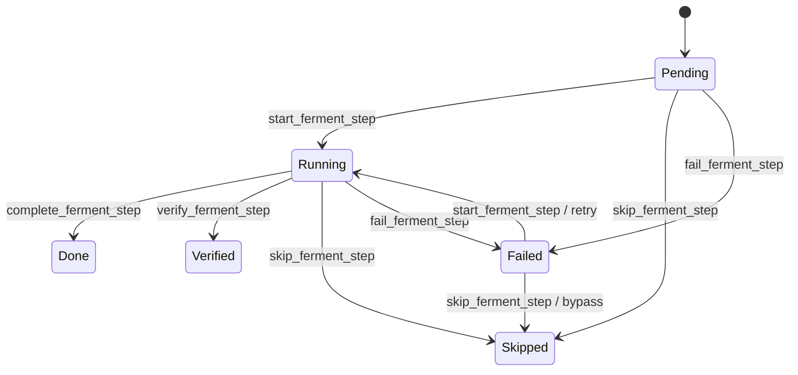

# Ferment — Autonomous Project Execution

Ferment is Kimchi's multi-session project mode. Give it a goal, it breaks the work into phases and steps, executes them using subagent workers, grades the results, and resumes automatically across sessions until the project is complete.

## The core idea

> "The plan IS the state."

Every ferment is a single JSON file in `.kimchi/ferments/<uuid>.json`. The harness reads this file at session start, a deterministic engine decides what to do next, and every action — activating a phase, completing a step, recording a decision — updates the file immediately. If the process crashes or the session ends, the next session resumes from exactly where it left off.

---

## Concepts

```
Ferment  ← the project ("Build Tetris")
│
├── Scoping answers (goal, criteria, constraints)
├── Decisions  ← architectural choices that shaped the work
├── Memories   ← conventions, gotchas, patterns discovered
│
└── Phases  ← milestones (1–7 recommended)
    │
    └── Steps  ← concrete tasks (3–6 per phase)
        ├── description
        ├── verification  ← optional bash command (exit 0 = pass)
        └── worker_model  ← minimax-m2.7 (code) or kimi-k2.5 (vision)
```

### Lifecycles

**Ferment status:**
```
draft → planned → running
          ↑          │
          └──────────┘ complete/skip/fail phase when no active phase remains

planned/running → complete   (explicit complete_ferment)
planned/running ⇄ paused     (internal user-intervention/session state)
draft/planned/running/paused/complete → abandoned
```

| Status | Meaning |
|--------|---------|
| `draft` | Created, scoping in progress |
| `planned` | Scoping confirmed, phases ready to execute |
| `running` | At least one phase is active |
| `paused` | Internal user-intervention/session state; ferment tools are blocked until resume |
| `complete` | Explicitly finalized after all phases are terminal |
| `abandoned` | Permanently stopped — cannot resume |

**Phase status:** `planned → active → completed / skipped / failed`

**Step status:** `pending → running → done / skipped / verified / failed` (`failed` steps can be recovered by starting them again)

### Tool visibility

Ferment follows pi-mono's run-level tool snapshot model: active tools are chosen
before an agent run starts and stay fixed for that run. Kimchi therefore uses
static session profiles instead of changing lifecycle tool visibility after
each FSM transition.

- Idle sessions expose discovery tools (`create_ferment`, `list_ferments`).
- Active planner sessions expose the current-ferment lifecycle tool surface;
  tool handlers and result text decide which transition is legal now.
- Paused or terminal ferments hide mutating lifecycle tools.
- Worker subagents (`KIMCHI_SUBAGENT=1`) receive no ferment lifecycle tools.
- One-shot planners use a static allowlist containing current-ferment lifecycle
  tools plus delegation tools (`Agent`, `get_subagent_result`) and `read`.

There is no shell CLI for phase or step transitions. Planners should call the
ferment tools directly and follow each tool result's `Next action:` hint.

---

## Work modes

Three modes control how much the agent asks versus acts autonomously.

| Mode | Behavior |
|------|----------|
| **plan** | Conversational. Shows dropdowns at phase boundaries. Asks before every step. Explains decisions. Best for complex or high-stakes work. |
| **exec** | Fully autonomous. No confirmations. Strips coaching text. Best for well-understood work or CI pipelines. |
| **auto** | Balanced (default). Full instructions visible. User chooses when to act. No forced gates. |

Switch modes at any time:
```
/ferment mode plan
/ferment mode exec
/ferment mode auto
```

---

## Quick start (interactive)

### 1. Create a ferment

```
/ferment add "Build Tetris"
```

Or type `/ferment` with no arguments for an input prompt.

The agent immediately begins scoping — one question at a time:

```
Agent: What does "done" look like for "Build Tetris"?
You:   Single HTML file, keyboard controls, scoring
Agent: What are the success criteria — how will you know it's done?
You:   Can play one full game without errors
Agent: Any constraints — things to avoid or non-negotiables?
You:   No libraries, vanilla JS only
Agent: Proposing 4 phases: Canvas & Grid / Pieces / Movement / Scoring
       Does this look right? Type yes to confirm.
You:   yes
```

The agent calls `scope_ferment` → status transitions to `planned`.

### 2. Execute

In **exec** mode the agent runs fully autonomously:
```
/ferment mode exec
```

It activates phases, refines them into steps, spawns subagent workers for each step, grades the results, and moves to the next phase — no input needed until it's done.

In **plan** mode you get a dropdown at every phase boundary:
```
┌──────────────────────────────────────┐
│ Phase 1 "Canvas & Grid" complete  A  │
│ Clean grid implementation            │
│                                      │
│ Next: Phase 2 "Piece Definitions"    │
│ Define and render all 7 Tetris pieces│
│                                      │
│ > Proceed to Phase 2                 │
│   Pause here                         │
│   Let me say something               │
└──────────────────────────────────────┘
```

### 3. Monitor progress

The dashboard widget is always visible above the editor:

```
🍺 Build Tetris  [running]
  ✓  Canvas & Grid    3/3  A
  ▶  Piece Definitions  1/3
       ▶  Define I and O pieces as 4-cell arrays…
       ○  Define S, Z, T, L, J pieces…
       ○  Render a preview of each piece…
  ○  Movement & Rotation  0/3
  ○  Scoring  0/3

context: 14 turns
/progress · /pause · /auto
```

Run `/progress` for full phase/step navigation with grades and actions.

### 4. Pause and resume

```
/pause     ← stop auto-mode (ferment stays "running")
/auto      ← resume
```

`/pause` only disables auto-mode. It does not persist the ferment as `paused`.
The persisted `paused` status is reserved for internal user-intervention and
session-resume paths.

Sessions resume automatically. When you close and reopen Kimchi with an active ferment, the agent picks up exactly where it left off.

---

## Grading

After every step and phase completes, an autonomous judge (Claude Opus 4.7) evaluates the work and assigns a letter grade.

| Grade | Meaning |
|-------|---------|
| A | Excellent — objective clearly met |
| B | Good — minor gaps |
| C | Acceptable — significant gaps |
| D | Poor — objective barely met |
| F | Failed — objective not met |

Grades are shown in the dashboard widget, `/progress` overlay, and injected back into the planner's context so later phases can learn from earlier ones.

---

## Decisions & memories

The planner captures knowledge that persists across phases and sessions.

**Decisions** — architectural or design choices:
```
D001: Use Canvas API — better performance than DOM for grid rendering
D002: Single game loop at 60fps — simpler than event-driven approach
```

**Memories** — conventions, gotchas, patterns:
```
M001 [gotcha]: requestAnimationFrame drops frames if loop takes >16ms
M002 [convention]: All piece coordinates are relative to their bounding box
M003 [pattern]: Use Uint8Array for grid — faster collision detection
```

Both are automatically injected into the planner's system prompt and every `activate_ferment_phase` result — so Phase 4 knows what Phase 1 decided without repeating context.

---

## Parallel phases

Phases with the same `parallel_group` number activate and run simultaneously.

When scoping, propose parallel phases:
```
Phase 3: "Backend API"  parallel_group: 1
Phase 4: "Frontend UI"  parallel_group: 1
Phase 5: "Deploy"       (sequential, runs after both complete)
```

The planner activates both group-1 phases at once, spawns subagents for each concurrently, and only moves to Phase 5 once both are done. Parallel phases are marked with `∥` in the dashboard.

---

## Stuck-loop protection

If `start_ferment_step` is called on the same step 3 or more times without a `complete_ferment_step`, the tool blocks further starts and surfaces an explicit recovery prompt to the user:

```
⚠ Stuck loop detected: step 2 "Implement collision detection" has been started
  3 times without completing. Stop and ask the user: should we retry with a
  revised approach, skip this step, or pause the ferment?
```

The block stays active until the step is either completed (`complete_ferment_step`) or skipped (`skip_ferment_step`).

---

## Context budget

The dashboard widget tracks assistant turns in the current session:

| Turns | Indicator |
|-------|-----------|
| < 30 | `14 turns` (dim) |
| 30–49 | `38 turns context growing` (yellow) |
| 50+ | `⚠ 52 turns — consider /compact` (orange) |

At 50+ turns model quality tends to degrade. Use `/compact` to summarise the session before continuing, or finish the current phase and let the next session start fresh.

---

## Headless usage

Ferment works fully without a TUI — useful for CI, scripts, and background runs.

### One-shot task

```
/ferment one-shot "Add OpenAPI spec export to the REST API"
```

Creates a ferment, scopes it automatically, and begins execution without requiring any interactive input.

### Headless session

Run Kimchi in headless mode with a pre-existing ferment:

```bash
KIMCHI_ACTIVE_FERMENT=<ferment-id> kimchi --headless
```

The session resumes the ferment, injects the next-action nudge, and executes. When execution stops (complete, paused, or error), the process exits. State is always written to disk before exit so the next invocation can continue.

### Environment variables

| Variable | Effect |
|----------|--------|
| `KIMCHI_ACTIVE_FERMENT` | ID of the ferment to resume on session start |
| `KIMCHI_SUBAGENT=1` | Set on worker child processes — skips session_start rehydration to prevent re-entrancy |

### Ferment state file

```
.kimchi/ferments/<uuid>.json
```

The file is the authoritative source of truth. You can inspect it directly, back it up, or copy it between machines. The schema is stable — see `src/ferment/types.ts`.

---

## Commands reference

| Command | Description |
|---------|-------------|
| `/ferment` | Interactive picker — create or switch |
| `/ferment add "Name"` | Create a new ferment |
| `/ferment list` | List all ferments |
| `/ferment switch <id>` | Switch active ferment by ID prefix or name |
| `/ferment delete <id>` | Delete a ferment permanently |
| `/ferment mode <plan\|exec\|auto>` | Change work mode |
| `/ferment abandon` | Abandon the active ferment (terminal — cannot resume) |
| `/ferment revise goal` | Revise a scoping field |
| `/ferment one-shot "task"` | Create and auto-execute a single task ferment |
| `/progress` | Open phase/step navigator overlay (toggle) |
| `/pause` | Pause auto-mode |
| `/auto` | Resume auto-mode |

---

## LLM tools reference

These tools are available to the agent during a ferment session. They are not meant to be called directly by users.

### Lifecycle

| Tool | Description |
|------|-------------|
| `create_ferment` | Create a new ferment at `draft` status |
| `propose_ferment_scoping` | Draft scoping for interactive confirmation |
| `scope_ferment` | Save confirmed scoping answers → `draft` to `planned` |
| `update_ferment_scope_field` | Update a single scoping field mid-draft |
| `set_ferment_mode` | Change work mode (`plan` / `exec` / `auto`) |
| `complete_ferment` | Mark the ferment `complete` after all phases are terminal |
| `list_ferments` | List ferments, optionally filtered by status |

### Phase execution

| Tool | Description |
|------|-------------|
| `activate_ferment_phase` | Transition a planned phase to active. Activates all phases in a parallel group simultaneously. |
| `refine_ferment_phase` | Populate a phase with concrete steps. |
| `complete_ferment_phase` | Mark phase as completed after phase gates pass. Leaves the ferment between phases unless another parallel phase remains active. |
| `skip_ferment_phase` | Skip a phase (counts as terminal) |
| `fail_ferment_phase` | Mark a phase as failed with a reason. The engine surfaces recovery before treating failed phases as terminal. |
| recovery | For a failed phase, retry with `activate_ferment_phase`, bypass with `skip_ferment_phase`, or ask the user whether to abandon. |

### Step execution

| Tool | Description |
|------|-------------|
| `start_ferment_step` | Mark step as running. Returns worker prompt context and any parallel siblings for concurrent dispatch. Blocks after 3 consecutive starts without a complete (stuck-loop guard). |
| `complete_ferment_step` | Mark step as done. Runs verification command automatically if set. |
| `verify_ferment_step` | Run the verification command manually and record the result. |
| `skip_ferment_step` | Skip a step (counts as terminal) |
| `fail_ferment_step` | Mark a step as failed with a reason |

### Knowledge

| Tool | Description |
|------|-------------|
| `add_ferment_decision` | Record an architectural or design decision. Injected into future phase context. |
| `add_ferment_memory` | Record a reusable insight. Categories: `architecture` / `convention` / `gotcha` / `pattern` / `preference`. |

---

## State machine (full)

### Ferment lifecycle



### Phase lifecycle



### Step lifecycle



---

## Implementation

Ferment is split into three layers:

```
┌──────────────────────────────────────────────────────────────────┐
│ Tool handlers (src/extensions/ferment/tools/*.ts)                │
│ - Validate UI-flow gates (scoping confirmation, stuck-loop)      │
│ - Run side effects (judge calls, nudges, bash verification)      │
│ - Format result text for the LLM                                 │
│        │                                                         │
│        │ build a Command, call applyAndPersist()                 │
│        ▼                                                         │
├──────────────────────────────────────────────────────────────────┤
│ State machine (src/ferment/state-machine.ts)                     │
│ - Pure transition logic: (ferment, command, ctx) → next ferment  │
│ - Enforces structural invariants (status transitions, etc.)      │
│ - Returns typed errors with codes (PHASE_NOT_IN_STATUS, …)       │
│ - No I/O, no time, no randomness — host injects via ctx          │
│        │                                                         │
│        │ next ferment, no side effects                           │
│        ▼                                                         │
├──────────────────────────────────────────────────────────────────┤
│ Storage (src/ferment/store.ts)                                   │
│ - Read/write `.kimchi/ferments/*.json` (atomic, cached)          │
│ - Convenience mutation methods (legacy, for TUI handlers)        │
└──────────────────────────────────────────────────────────────────┘
```

The state machine is pure: same inputs always produce the same outputs, no
hidden state. This makes it exhaustively testable (58 unit tests cover every
command × prerequisite-state combination) and reusable — a future server-side
state service would consume the same module.

| File | Role |
|------|------|
| `src/extensions/ferment/index.ts` | Extension entrypoint — event handlers, slash commands |
| `src/extensions/ferment/tools/*.ts` | Tool registrations (lifecycle, phases, steps, knowledge) |
| `src/extensions/ferment/tool-scope.ts` | Static session profiles for ferment tool visibility |
| `src/extensions/ferment/tool-helpers.ts` | `applyAndPersist` bridge + result builders |
| `src/ferment/state-machine.ts` | Pure transitions: (ferment, command) → next ferment |
| `src/ferment/engine.ts` | Forward state machine: ferment → next action (`whatNext`) |
| `src/ferment/store.ts` | Persistence — read/write `.kimchi/ferments/*.json` |
| `src/ferment/types.ts` | TypeScript types for all ferment data |
| `.kimchi/ferments/<uuid>.json` | Persisted ferment state (one file per ferment) |
