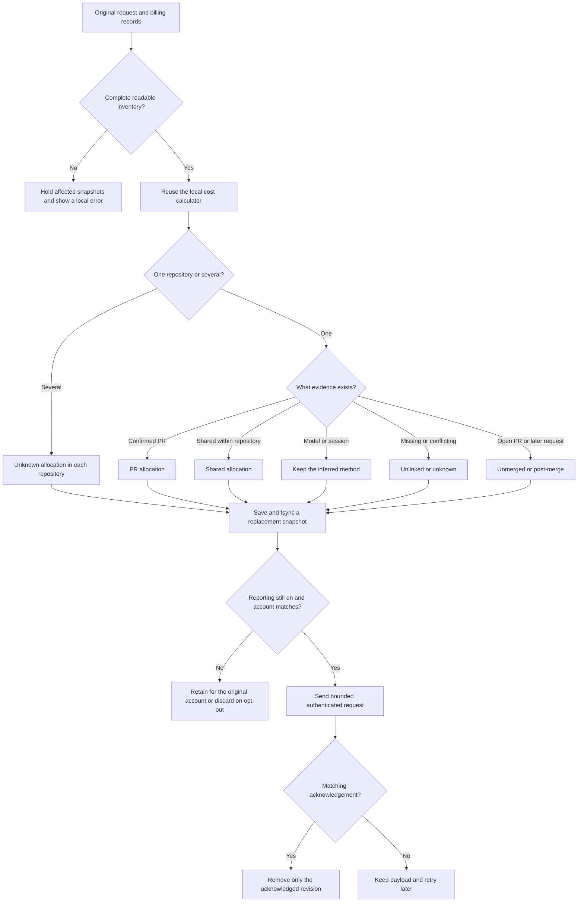
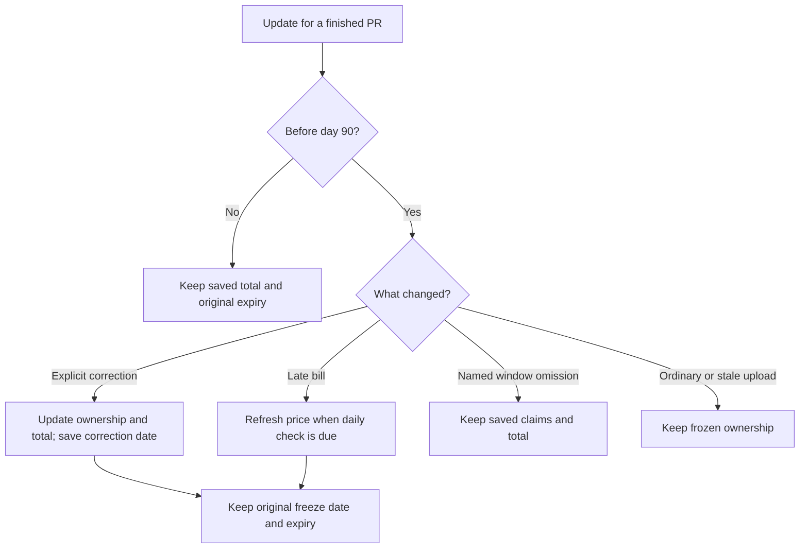

# PR cost reporting

PR cost reporting follows the SaaS telemetry setting by default. When SaaS uploads are on, Kimchi reports existing work automatically, including requests made before a PR exists. An explicit `/pr-reporting on` or `off` overrides that default and survives restart. Existing saved choices are preserved.

The first interactive main session shows one notice that PR costs are reported, with `/pr-reporting off` to disable it. Studio shows it as a notification after the first turn, because notifications sent before a session is registered are dropped. The notice is saved per installation and does not repeat after restart. It is skipped when reporting is off or the user already made an explicit choice.

- `/pr-reporting on` enables uploads for the verified account and requests an immediate update.
- `/pr-reporting status` shows whether reporting follows the SaaS default or an explicit choice, plus queued repositories, acknowledgements and delivery problems.
- `/pr-reporting off` cancels delivery and deletes pending payloads. Local work history and revision counters remain. Reports already accepted by the server remain there.

Only main sessions with work tracking run this extension. Child sessions contribute their existing request records through the local calculator; they do not start upload workers. Removing work tracking leaves the independent branch PR status available.

The worker gathers the existing local inventory at startup, refreshes after each agent turn when reporting is on, and checks again every 30 seconds while Kimchi runs. A request can first appear as unlinked or unknown, then gain a PR and a price in later reports. Changed reports receive a higher `revision` and a new `generatedAt`; the server replaces the previous report, so repeated updates do not add the same charge again. A running pass or a saved retry deadline can delay an update.

Teleport transfers conversation history but does not transfer the local accounting journals or account scope. On a fresh sandbox, normal continuation starts a new work on the first input. An explicitly selected work keeps its ID, but its missing scope remains unknown. Neither case establishes a complete cost across local and remote work. Remote-agent accounting is outside this reporting change.

## What leaves the machine

Each upload replaces one producer's inventory for one account and repository. It contains:

- The Git provider, host, stable target repository ID, and optional repository name.
- Stable PR/MR IDs, numbers, links, state and merge or close times.
- Exact request attempt UUIDs, verified billing-row UUIDs and request start times.
- Allocation kind, referenced PR IDs and evidence method. An `unknown` request names the PRs it may belong to, so only those totals stay incomplete. An input whose native edits landed in the PR sends `native`; other session inputs send `session` and stay likely. Continued plans send `explicit`; `/work link` corrections send `user-correction`. Model guesses send `model` and stay likely.
- Request counts, missing-price counts, history completeness and the latest applicable cost refresh time.

Two optional fields explain later updates. `windowedPullRequestIds` lists finished PRs deliberately left out of this upload. A request's `correction` contains the validated link's UUID, revision, time and source (`work-command` or `producer-confirmation`). The source distinguishes an explicit `/work link` or `/work unlink` from a verified saved-plan or artifact confirmation.

Kimchi does not upload prompts, plans, messages, local paths, work IDs, session IDs, commit hashes, credential fingerprints or prices. The backend reads its own billing rows. A request without a confirmed price remains in the inventory; it is not reported as free. Authentication determines the contributor; the body has no user field.

An upload with one request still waiting for billing looks like this:

```json
{
  "schemaVersion": 1,
  "producerId": "11111111-1111-4111-8111-111111111111",
  "revision": "3",
  "generatedAt": "2026-10-05T12:00:00.000Z",
  "repository": { "provider": "github", "host": "github.com", "id": "42", "name": "example/repo" },
  "pullRequests": [],
  "requests": [{
    "requestId": "22222222-2222-4222-8222-222222222222",
    "billingRecordIds": [],
    "startedAt": "2026-10-05T11:59:00.000Z",
    "allocation": { "kind": "unknown", "pullRequestIds": [], "method": "session" }
  }],
  "coverage": { "observedRequests": 1, "unpricedRequests": 1, "historyComplete": true }
}
```

## Matching and delivery



GitHub IDs come from the PR's `id` and target `base.repo.id`. GitLab IDs come from the MR's `id` and `target_project_id`. A fork's source repository ID never replaces the target ID. Old merged links without these IDs are refreshed.

The inventory comes from the original journals through the same billing validation and calculator used by local cost summaries. It does not concatenate per-work `costs.json` files. Two works contributing to one PR do not duplicate requests. Cross-repository shared requests are reported as unknown in each repository; the backend handles duplicate billing evidence across snapshots. A request that starts after several PRs merged keeps all candidate IDs as a shared claim. The backend compares its start time with each merge time and places it outside those PR totals.

Records without their original account or repository are skipped; Kimchi never attaches them to today's login. Independent valid repositories can still report with `historyComplete: false`. Only records of work with repository evidence (a scoped request or a commit) count; a question asked outside Git has neither. Records that would fall outside the upload window anyway do not affect completeness. Missing earlier requests or conflicting provider metadata hold the affected repository. A GitLab MR with no merge time leaves its requests unknown while other MRs keep reporting. An unparseable final journal line without a newline is ignored as an interrupted append, as is a cut-off record that later appends moved past (older versions start a new line after it). Other malformed records, including a cut-off final record, and unreadable journals still hold the scan. These cases appear in `/pr-reporting status`. `historyComplete` describes the captured inventory, not activity before tracking was installed or while it was disabled.

## Local state and retries

State lives under `getAgentDir()`:

```text
~/.config/kimchi/harness/pr-cost-reporting/state.json
```

An isolated harness home uses its own directory. The state file contains consent, a producer UUID, account/repository revision bookkeeping and pending snapshots. It also keeps a salted hash of the operating system's machine ID: a home restored or migrated onto another machine starts a new producer with empty bookkeeping, so two machines never replace each other's claims. The server deduplicates bills across producers, so copied history is not counted twice. Revision bookkeeping includes SHA-256 values of request UUIDs from acknowledged and possibly delivered snapshots, so a later incomplete scan cannot silently remove earlier claims. These hashes shrink to the new membership only when that exact revision is acknowledged. A lost or late acknowledgement leaves the earlier evidence intact. Opt-out retains these membership hashes and revision metadata, but removes pending bodies and raw request/billing IDs. Files are private to the local user. A lock protects concurrent writers; a synced temporary file and rename publish each update before HTTP starts.

Only the newest pending snapshot for a repository is retained. Corrections and revocations with preserved request membership replace earlier allocations. When all requests move to another verified repository in the same account, an empty higher-revision snapshot withdraws the old group. The old membership remains protected while that withdrawal is pending, including after opt-out and restart. Missing source evidence alone cannot trigger that withdrawal. An acknowledgement for an older in-flight revision cannot delete a newer payload. Restarting resumes durable state instead of adding the same charges again.

The existing reconciliation worker runs reporting after local cost lookup. Each pass has a five-second budget, with at most three upload attempts. Verification and upload reject redirects and cap response bodies at 64 KiB. Credentials and endpoint are checked again after awaited operations and immediately before dispatch. Opt-out from another harness process cancels an active upload through a local state-file watcher.

Repository lookups share that budget. Successful identities are cached for five minutes; failed lookups wait at least 30 seconds before retry. Unchecked repositories go first, and each pass reserves time to queue and deliver the repositories it already knows. A slow or unavailable provider does not discard that progress.

Failed attempts retain their payload and retry time, including `Retry-After`. A rejection that retrying cannot fix, such as HTTP 404 from a backend without this endpoint or HTTP 429 without `Retry-After` for a full storage allowance, waits one hour, then up to six hours; timeouts, rate limits with `Retry-After` and server errors retry within a minute. An unavailable or older backend therefore leaves a visible pending report. Nothing is sent to a different account to clear that queue.

Uploads are limited to 2 MiB, 10,000 requests, 100 PRs and 8 billing IDs per request. An oversized inventory is held with an error; it is never silently truncated. The local queue is bounded to 24 MiB. No request, session, PR or user IDs are added to metric labels.

## Upload window and saved totals

The client sends each request from the last 32 days and each request that may belong to an open PR. A merged or closed PR stays in uploads with all its contributing requests for 32 days plus two days of clock-skew grace after its provider-reported finish time. Older requests of a long-lived work stay out, so snapshots stay small. A correction receipt is sent only while the server can still apply it, until five minutes before the PR's details expire at day 90. Missing finish metadata keeps the work eligible. The local source inventory distinguishes requests deliberately left outside this window from records that went missing; missing evidence still holds an affected upload.

The client names intentionally omitted finished PRs in `windowedPullRequestIds`. The server keeps those PRs and their claims, including when its clock has not reached day 32 yet. Omitting a PR without naming it withdraws its uploaded claims; it does not silently change an already frozen assignment.

At day 32 the server saves a frozen subtotal. It keeps detailed claims for 90 days after merge or close, then retains only the small report for 13 calendar months from the original freeze date. Missing prices and disputed ownership stay incomplete. Expiring one PR's details does not mark the rest of the repository's recorded history incomplete.

Until day 90, an explicit `/work link`, `/work unlink` or verified producer confirmation can correct frozen ownership. The server saves the changed total before acknowledging an accepted correction and records `correctedAt`; `frozenAt` and archive expiry stay unchanged. Replayed corrections and ordinary uploads cannot move frozen costs. The dashboard shows both dates.

For attempts without billing IDs, the server checks the exact request tag. A complete empty lookup settles the attempt at $0 once it is 24 hours old. Missing and zero prices are checked again about once a day after freezing, until day 90, so late bills can still count. The saved check time survives server restarts. Failed lookups preserve the last verified price and cannot settle an attempt. After day 90 the saved total and any missing prices remain as they are.



The backend keeps organization-wide size limits. An upload from a contributor using over half an allowance is rejected with that contributor's ID; the rejected upload leaves existing reports readable.

## Health metrics

The existing telemetry setting controls these metrics separately from `/pr-reporting`. They use the normal telemetry flush; there is no extra history scan or model call.

- `kimchi.pr_cost.matching.count` counts one final outcome per input: `explicit`, `inferred`, `session`, `unknown`, `limited` (too much history to compare) or `failed`.
- `kimchi.pr_cost.delivery.count` counts delivery attempts, including account verification: `success`, `failed` or `canceled`.
- `kimchi.pr_cost.pricing.unpriced` records the unpriced request count from the latest local cost report.
- `kimchi.pr_cost.queue.depth` records repository snapshots waiting for acknowledgement, including zero after the queue clears.
- `kimchi.pr_cost.reconciliation.age` records seconds since the worker last started a scan. It measures liveness, not lookup success.

Only `client=pi` and the fixed outcome appear as labels. The metrics add no session, user, work, request, repository or PR identifiers. Turning telemetry off drops buffered health counts and stops retries; turning it back on starts a new counter stream. An already dispatched request cannot be recalled.

`kimchi config telemetry off` changes a local consent version in the settings file. A quick `off` then `on` from another terminal also discards older health batches, even when the running session did not check settings while telemetry was off. This version stays local and is not sent as a metric label.

Counters are cumulative within their OTLP start time; gauges describe the latest observed state and can decrease. Repeated exports must keep the latest value for that stream. Backend health queries use raw samples rather than session-based productivity rollups. These metrics help find missing prices and stuck delivery; they do not establish matching accuracy or change any PR total.

## Validation scope

Colocated tests cover fork target IDs, legacy refresh, source validation, exact billing IDs, privacy, missing prices, inferred and cross-repository allocation, consent, account changes, replacement revisions, restart, late acknowledgements, retries, response limits and shutdown. HTTP tests use local fixtures; they do not establish that a shared backend deployment is available.
