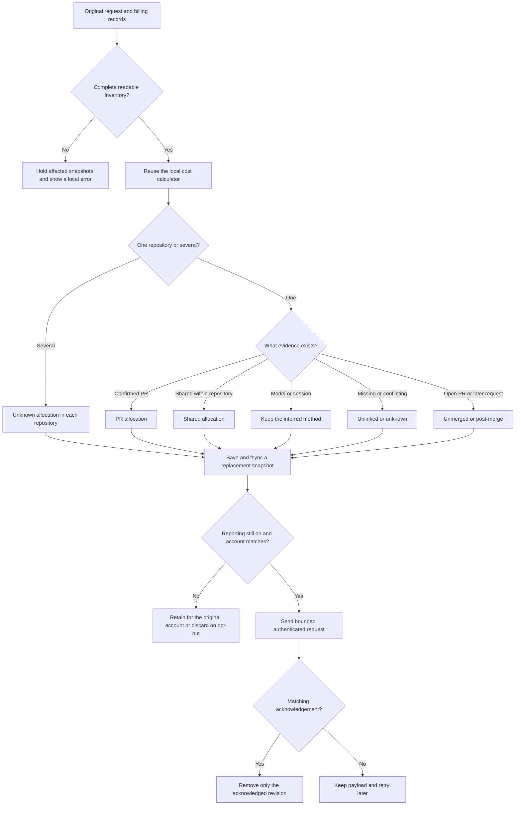

# PR cost reporting

PR cost reporting is off by default. Local work tracking and the branch PR link work without it.

- `/pr-reporting on` allows background uploads for the verified account.
- `/pr-reporting status` shows queued repositories, acknowledgements and delivery problems.
- `/pr-reporting off` cancels delivery and deletes pending payloads. Local work history and revision counters remain. Reports already accepted by the server remain there.

Only main sessions with work tracking run this extension. Child sessions contribute their existing request records through the local calculator; they do not start upload workers. Removing work tracking leaves the independent branch PR status available.

## What leaves the machine

Each upload replaces one producer's inventory for one account and repository. It contains:

- The Git provider, host, stable target repository ID, and optional repository name.
- Stable PR/MR IDs, numbers, links, state and merge times.
- Exact request attempt UUIDs, verified billing-row UUIDs and request start times.
- Allocation kind, referenced PR IDs and evidence method. Model and session methods remain inferred.
- Request counts, missing-price counts, history completeness and the latest applicable cost refresh time.

Kimchi does not upload prompts, plans, messages, local paths, work IDs, session IDs, commit hashes, credential fingerprints or prices. The backend reads its own billing rows. A request without a confirmed price remains in the inventory; it is not reported as free. Authentication determines the contributor; the body has no user field.

An upload with one request still waiting for billing looks like this:

```json
{
  "schemaVersion": 1,
  "producerId": "11111111-1111-4111-8111-111111111111",
  "revision": "3",
  "generatedAt": "2026-10-05T12:00:00.000Z",
  "repository": { "provider": "github", "host": "github.com", "id": "42", "name": "example/repo" },
  "pullRequests": [],
  "requests": [{
    "requestId": "22222222-2222-4222-8222-222222222222",
    "billingRecordIds": [],
    "startedAt": "2026-10-05T11:59:00.000Z",
    "allocation": { "kind": "unlinked", "pullRequestIds": [], "method": "native" }
  }],
  "coverage": { "observedRequests": 1, "unpricedRequests": 1, "historyComplete": true }
}
```

## Matching and delivery



GitHub IDs come from the PR's `id` and target `base.repo.id`. GitLab IDs come from the MR's `id` and `target_project_id`. A fork's source repository ID never replaces the target ID. Old merged links without these IDs are refreshed.

The inventory comes from the original journals through the same billing validation and calculator used by local cost summaries. It does not concatenate per-work `costs.json` files. Two works contributing to one PR do not duplicate requests. Cross-repository shared requests are reported as unknown in each repository; the backend handles duplicate billing evidence across snapshots. A request that starts after several PRs merged keeps all candidate IDs as a shared claim. The backend compares its start time with each merge time and places it outside those PR totals.

Records without their original account or repository are skipped; Kimchi never attaches them to today's login. Independent valid repositories can still report with `historyComplete: false`. If a group's earlier request membership disappears or its provider evidence is incomplete, that group is held while others progress. Malformed or unreadable journals hold the whole scan because their impact cannot be bounded. These cases appear in `/pr-reporting status`. `historyComplete` describes the captured inventory, not activity before tracking was installed or while it was disabled.

## Local state and retries

State lives under `getAgentDir()`:

```text
~/.config/kimchi/harness/pr-cost-reporting/state.json
```

An isolated harness home uses its own directory. The state file contains consent, a producer UUID, account/repository revision bookkeeping and pending snapshots. Revision bookkeeping includes SHA-256 values of request UUIDs from acknowledged and possibly delivered snapshots, so a later incomplete scan cannot silently remove earlier claims. These hashes shrink to the new membership only when that exact revision is acknowledged. A lost or late acknowledgement leaves the earlier evidence intact. Opt-out retains these membership hashes and revision metadata, but removes pending bodies and raw request/billing IDs. Files are private to the local user. A lock protects concurrent writers; a synced temporary file and rename publish each update before HTTP starts.

Only the newest pending snapshot for a repository is retained. Corrections and revocations with preserved request membership replace earlier allocations. When all requests move to another verified repository in the same account, an empty higher-revision snapshot withdraws the old group. The old membership remains protected while that withdrawal is pending, including after opt-out and restart. Missing source evidence alone cannot trigger that withdrawal. An acknowledgement for an older in-flight revision cannot delete a newer payload. Restarting resumes durable state instead of adding the same charges again.

The existing reconciliation worker runs reporting after local cost lookup. Each pass has a five-second budget, with at most three upload attempts. Verification and upload reject redirects and cap response bodies at 64 KiB. Credentials and endpoint are checked again after awaited operations and immediately before dispatch. Opt-out from another harness process cancels an active upload through a local state-file watcher.

Failed attempts retain their payload and retry time, including `Retry-After`. An unavailable or older backend therefore leaves a visible pending report. Nothing is sent to a different account to clear that queue.

Uploads are limited to 2 MiB, 10,000 requests, 100 PRs and 8 billing IDs per request. An oversized inventory is held with an error; it is never silently truncated. The local queue is bounded to 24 MiB. No request, session, PR or user IDs are added to metric labels.

## Health metrics

The existing telemetry setting controls these metrics separately from `/pr-reporting`. They use the normal telemetry flush; there is no extra history scan or model call.

- `kimchi.pr_cost.matching.count` counts one final outcome per input: `explicit`, `inferred`, `session`, `unknown` or `failed`.
- `kimchi.pr_cost.delivery.count` counts delivery attempts, including account verification: `success`, `failed` or `canceled`.
- `kimchi.pr_cost.pricing.unpriced` records the unpriced request count from the latest local cost report.
- `kimchi.pr_cost.queue.depth` records repository snapshots waiting for acknowledgement, including zero after the queue clears.
- `kimchi.pr_cost.reconciliation.age` records seconds since the worker last started a scan. It measures liveness, not lookup success.

Only `client=pi` and the fixed outcome appear as labels. The metrics add no session, user, work, request, repository or PR identifiers. Turning telemetry off drops buffered health counts and stops retries; turning it back on starts a new counter stream. An already dispatched request cannot be recalled.

Counters are cumulative within their OTLP start time; gauges describe the latest observed state and can decrease. Repeated exports must keep the latest value for that stream. Backend health queries use raw samples rather than session-based productivity rollups. These metrics help find missing prices and stuck delivery; they do not establish matching accuracy or change any PR total.

## Validation scope

Colocated tests cover fork target IDs, legacy refresh, source validation, exact billing IDs, privacy, missing prices, inferred and cross-repository allocation, consent, account changes, replacement revisions, restart, late acknowledgements, retries, response limits and shutdown. HTTP tests use local fixtures; they do not establish that a shared backend deployment is available.
