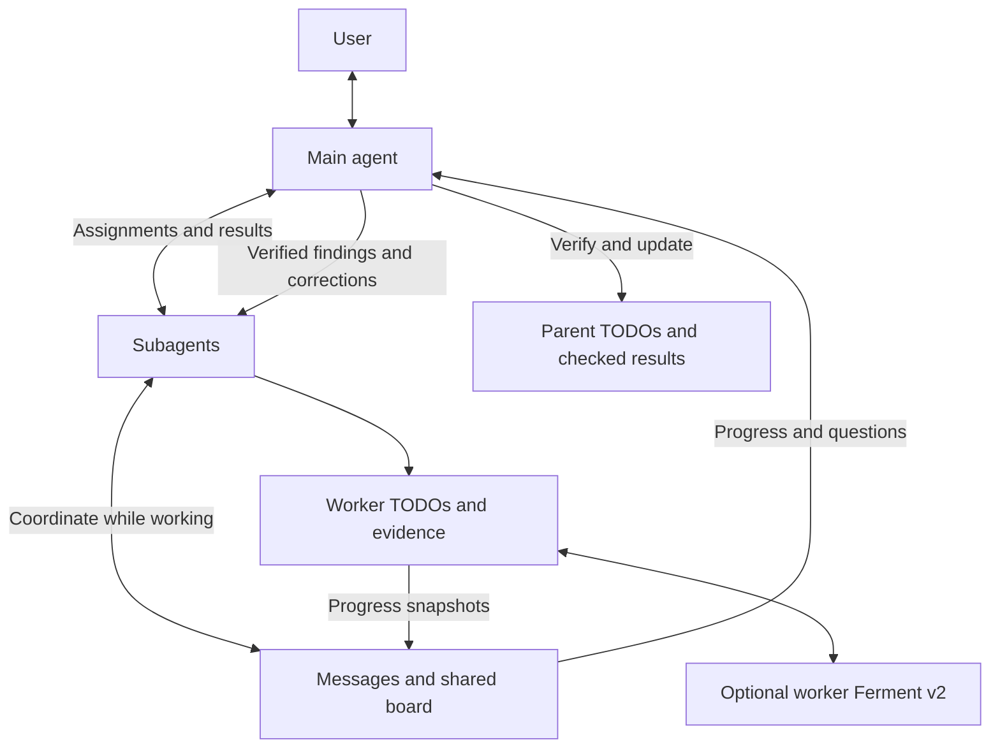
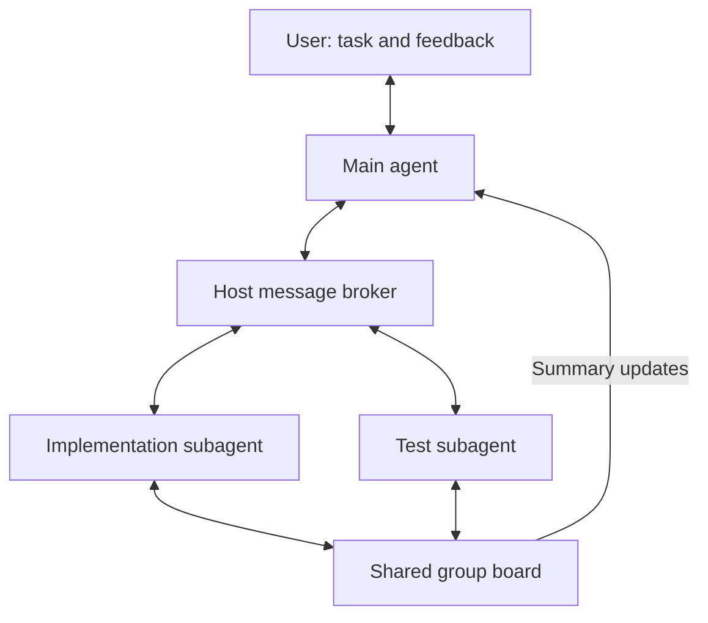

# Internal agent communication

The main agent already delegates work to subagents and collects their results. This new communication layer lets subagents communicate while working. They can ask each other questions, share findings on a group board and report progress or blockers to the main agent before returning a final result.

For example, an implementation subagent changes an error response and posts the new contract to the group board. A test subagent asks about compatibility and uses the answer in its checks. The main agent receives progress updates and handles decisions that affect the overall task.

Live messages and the group board are experimental features on this branch, scoped to workers within a Kimchi session.

Live tests show that peer feedback can correct code and reviewer tests during a task. The recent controlled comparisons do not establish a repeatable final-quality or cost improvement. The [observed results](communication.md#observed-results) show both useful exchanges and negative outcomes.

## The user journey

1. The user describes the outcome, scope and checks.
2. The main agent spawns subagents when the work benefits from it or the user requests it. Each subagent gets a defined scope and checks.
3. Workers exchange questions and handoffs, and post findings or blockers to their group board.
4. The main agent answers questions or asks the user, then returns feedback to the affected workers.
5. The main agent checks the combined result and updates the task's progress before reporting completion.

## How the pieces fit

`AgentManager` manages worker identity, lifecycle and communication. The host authorizes contact using the worker's identity and group membership.

### General architecture

### Example exchange

In the example above, messages pass through the host broker and both subagents read and write the group board:

| Mechanism | Purpose | Behavior |
|---|---|---|
| Directed messages | Questions and handoffs | The host authorizes contact with the parent or a peer. User questions go through the main agent; replies reference their question. |
| Group board | Shared findings, warnings and work notes | Append-only posts. Successful worker TODO writes publish snapshots. Peers and the main agent can read entries; the main agent also receives summaries. Posts do not assign work or wake every peer. |
| Final result | Completed or blocked work | Subagents return the outcome through the existing Agent result/report path. The main agent checks it against the task. |

Local messages use Pi's steering and follow-up queues. Board hints refresh through the existing request-context hook without starting a new turn. A delivery receipt records routing; it does not establish that the receiving agent read or acted on the message.

The host stores the board in memory for one session and group. Access requires at least two eligible workers in one host-created batch, normally background spawns with `communication: "group"`. Retention is bounded; restarting the host loses the board. The host supplies identity and membership. A peer's message cannot grant permissions or expand scope.

## Reuse across Kimchi

Communication uses the existing agent lifecycle, worker queue, progress display and result handling. After a communicating subagent finishes, the main agent runs a check or reads the resulting artifact, then calls `reconcile_agent_result` with the worker ID, TODO ID and a description of what it verified. The tool completes that TODO and retains the worker attempt and parent check reference in an `Evidence:` note. Board posts do not automatically update TODOs.

Reconciliation requires a successful parent `bash` or `read` result from after the worker's latest completion. It rejects foreign workers, unfinished reports and stale checks. The main agent still judges whether the check covers the task; the host validates the reference and worker state.

The main agent can set `ferment_v2: true` on a local worker to run its task under its own objective, TODOs and evidence checks. Each session retains ownership of its list. Findings return through existing messages; the recipient verifies them before updating its evidence.

When enabled, the parent's Ferment v2 can use checked parent progress in its continuation checks. Its objective revisions, session journal and compact evidence notes support long work. The same communication tools apply to ordinary sessions and approved plans; Ferment is optional.

The [detailed write-up](communication.md) covers these connections, the evidence flow and the tradeoffs between sequential work and delegation.

## Technical references

[Messaging protocol](subagent-communication-protocol.md) · [Agent configuration](../agents.md) · [Manager](../../src/extensions/agents/manager/agent-manager.ts) · [Board](../../src/extensions/agents/manager/board.ts)

Source checked on branch `feat-agent-comms-imprv`, based on commit `52fb3e2c0b0433056a194a309c777618719625a1` with local reconciliation and communication changes, on 2026-09-16.
