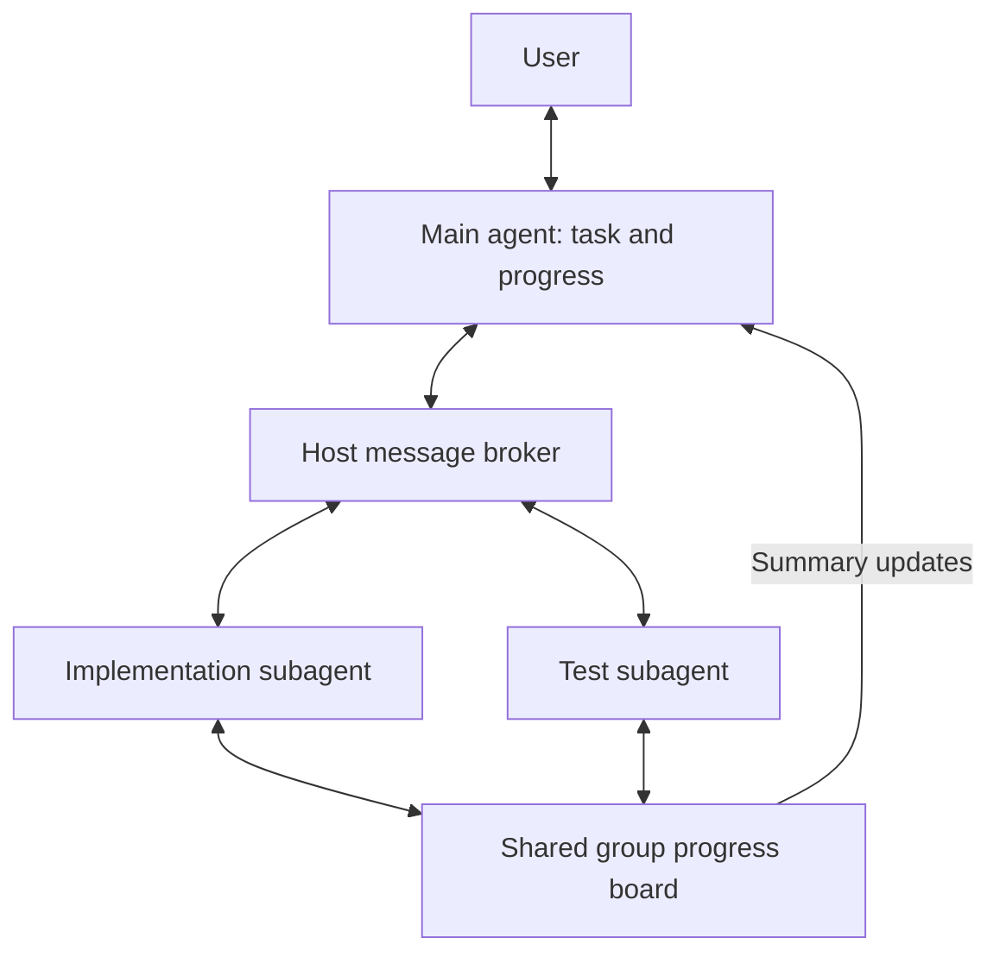
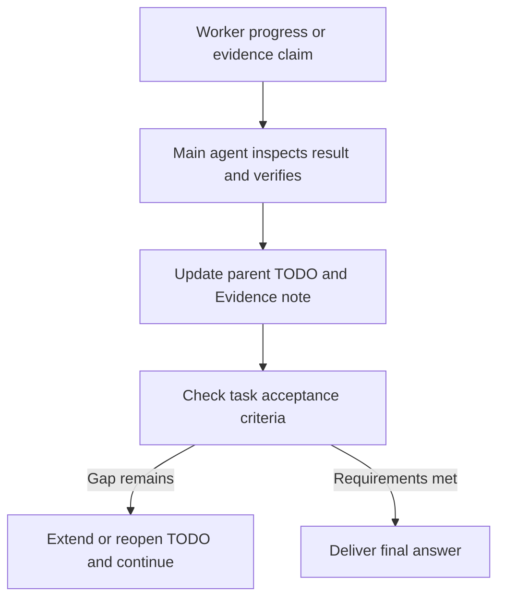

# Agent communication for long tasks

A main agent working through a long refactor may delegate implementation, tests and review, then collect the subagents' results. The communication layer lets those subagents exchange information while their assignments are running and send progress or blockers back to the main agent before they finish.

Subagents use directed messages and a shared progress board. An implementation subagent posts a changed error contract; the test subagent asks it about compatibility and uses the answer in its checks. The main agent follows progress, handles decisions affecting the overall task and checks the combined result. Ferment v2 can keep the main agent working toward an objective. The main agent can also launch a local worker with `ferment_v2: true` to give that worker its own objective and completion checks.

Communication connects to Kimchi's agent creation, user questions, TODOs, review and long-running work. Messages and the board carry worker reports. The parent uses `reconcile_agent_result` to connect completed work and a parent check to an existing TODO. Successful worker TODO writes publish progress to the group board. Receiving a post does not change the reader's TODOs.

## User journey and value

1. The user and main agent agree on the outcome and checks. The main agent keeps visible progress in the task's TODOs or plan.
2. The main agent spawns multiple agents when the situation benefits from it or the user requests it. Each worker gets ownership and checks; tightly coupled work stays sequential.
3. Workers post shared findings, decisions and blockers, and read relevant entries before dependent work. Directed messages carry questions, answers, timely findings and handoffs.
4. The main agent answers or asks the user, checks results and updates the relevant TODO with evidence or a remaining gap.
5. The main agent compares the combined result with the agreed checks and resolves gaps before the final answer. Ferment v2 can automate a continuation check when enabled.

A subagent can use another subagent's discovery before either finishes, and the main agent can respond to a blocker during execution. This may reduce duplicated investigation and rework when the results are combined. The user continues to interact with the main agent.

## Observed results

Live tests show that peer feedback can correct code and reviewer tests during a task. Controlled comparisons have not established a repeatable improvement in final quality, readability, speed or cost. The latest normal/communication pair passed the public checks but shared a timeout-cleanup defect found in a separate check. Neither used messages or board reads. Two later runs with an explicit cross-review assignment used both channels, but omitted parts of the review and did not establish a quality gain; the [communication-use report](communication-use.md) separates these outcomes.

The [evidence page](evaluation.md) retains the comparisons, failed attempts and useful individual exchanges. It also links the verified storage, notification and question-lifecycle improvements. Communication remains optional: use it when a finding or unresolved dependency can change another agent's work.

## Sequential work and delegation

Tightly dependent edits may be best handled sequentially. Independent investigations and fresh reviews are better candidates for delegation. Shared files already carry code, tests and notes; messages can expose an unresolved decision or a costly discovery before it reaches those artifacts.

The [research review](communication-research.md) covers papers, practitioner reports and systems outside coding. It supports selective communication around dependencies, with no posting quota or extra agents added just to use the board.

## Things to reuse and integrate

Ordinary sessions, approved plans and Ferment runs can use the same communication tools and task records. The board carries shared discoveries and progress; TODOs track accepted work, and artifacts hold the supporting detail.

| Existing part | What to reuse | Where communication connects |
|---|---|---|
| Agent runtime | Existing spawning, host-owned identities, group membership, messages and board events. | Workers share findings and handoffs within the task. Board summaries refresh in the main agent's request context; directed messages use its existing follow-up channel. |
| User questions and feedback | Worker questions routed through the main agent, with replies associated with their questions. | A developer's decision returns to the affected worker; shared implications can be posted for its peers. |
| TODOs and plans | Existing task references, ownership and pending, in-progress, blocked and completed states. | Workers keep session-local lists, restored from their own journals. Successful writes publish progress snapshots; the main agent verifies results before accepting them into its list. |
| Evidence, review and lessons | Linked checks and artifacts; `Evidence:`, `Decision:` and `Dead-end:` notes. Ferment v2 already retains up to five settled-TODO lessons through its journal. | Verified outcomes inform review and continuation. Worker claims remain distinct from checked results. |
| Ferment v2 | Objective revisions, session journal, completion evaluation and stall checks. | The parent and opted-in workers each evaluate their own objective and TODO evidence. Existing messages carry findings back to the owner. Communication also works without Ferment. |

Existing Ferment mechanisms are described in the [runtime guide](../ferment-v2.md), [lesson extraction](../../src/extensions/ferment-v2/lessons.ts), [progress checks](../../src/extensions/ferment-v2/runtime-policy.ts) and [evaluator](../../src/extensions/ferment-v2/evaluator.ts). The runtime, messaging and TODO sources are linked below.

Whether agents work sequentially or in parallel, the main agent brings their results back into the shared task and checks the combined outcome before claiming completion.

## Messages and the progress board

The [general architecture](README.md#general-architecture) connects delegation, live communication, results and task progress. This example shows two subagents using the communication paths:



`AgentManager` authorizes contact using host-owned identities and group membership. User questions return through the main agent. Replies reference their question; the first authorized answer or decline closes it. Receipts record routing outcomes. The main agent checks task completion separately.

Peer contacts expose `agent_id`, which identifies the recipient of a message. Task IDs remain in host task records and handoff evidence.

A new question or update cannot carry `reply_to`; the tool rejects it with a correction before routing. When a worker mistypes a reply ID, the host can return `openQuestionIds` for questions from that recipient addressed to the caller. The worker selects the intended ID and submits a corrected reply. The rejected attempt sends nothing and leaves questions open.

For an answer or decline, `send_agent_message` accepts the explicit `reply_to` either beside `payload` or inside it. The tool moves a nested ID into the existing host input before validation. Different IDs in both locations are rejected; the tool never chooses a question or changes the recipient.

Failed sends and parent replies appear as tool errors, retaining the host receipt's reason and any recovery details. Accepted queue and resume receipts remain successful tool results; the recipient's work still needs checking.

Denied board reads and posts also appear as tool errors with the host's exact reason. An authorized read of an empty board remains successful. A lone worker has no group board; it can still report to its parent.

Board access requires a queued or running group worker in the active communication root. Finished worker records grant no worker access. The bound parent can read retained entries with `read_agent_board`, supplying the exact `group_id` from its digest. An unknown group returns an error with the parent's available group IDs. Disabling communication clears that root's boards and rejects late reads or posts, so a retained tool capability cannot recreate them.

For `communication: "group"`, the main agent's task guidance includes a coordination section: the peer roles, shared decision or interface, finding to post, recipient to contact and information to read before dependent work. For example, an implementation owner posts its proposed error contract and asks the test owner to check compatibility before dependent edits.

The worker prompt asks each group member to discover contacts and read the board at the start, publish useful findings during execution, and send the affected owner the entry ID and needed action. Before its final result, the worker checks new relevant findings and reports any unresolved handoff. An empty board leaves independent work available. These are model instructions; the host does not require a message count before completion.

Corrections are follow-up posts. Eligible workers see the count and latest ID of other workers' deliberate posts in their next model request, using the same context hook as TODO state. Own posts and automatic TODO updates do not prompt a board check; manual work notes still do. An unfiltered successful read that reaches the latest peer entry clears the hint until another peer post arrives; failed or incomplete reads leave it visible.

Explicit reads and the parent's view retain all authors and automatic progress. The main agent's context refreshes with up to three recent titles per group, including author, kind and entry ID. These hints contain no entry bodies and are not saved in session history. A board post does not start a new parent turn or interrupt a running tool.

Workers do not need a separate status post after writing TODOs: the host publishes a bounded snapshot with the session and tool-result reference. It includes up to eight items, shortened descriptions and notes. The board retains only the latest automatic snapshot for each worker, session and TODO scope; the journal retains full history. Manual findings and work notes remain unchanged. A replaced snapshot gets a new entry ID, so a reader sees the update; an old cursor falls back to the retained entries.

The board is scoped to one host session and group. Worker access requires at least two eligible workers batched together, normally background spawns with `communication: "group"`. Accepted entries are saved as `agent-board:entry:v1` records in the owning parent's Pi session journal. Session start, reload and branch selection rebuild the bounded view from that branch, preserving original IDs and replacing superseded TODO snapshots. Malformed entries and entries from another root are ignored. A fork does not inherit the original root's board.

The parent can read recovered findings without the original worker records. Recovery creates no live contacts, workers, message threads or verified evidence. The parent checks the cited artifact before passing context to a replacement worker. Disabling communication clears the live view and prevents recovery while disabled; existing session history remains on disk. Sessions saved before this change have no board records to recover.

## From worker reports to task progress

Local workers load the existing loop guard alongside their other built-in extensions. Repeated tool calls with identical results can stop the worker with `agent_outcome.reason: "loop_guard"`. The parent receives an aborted outcome and checks the saved work before deciding whether to resume. A resume clears the previous attempt's stop flag; worker-local Ferment still reports its own objective status separately.

A local `Agent` call can set `ferment_v2: true`. Its prompt becomes the worker's objective. The worker uses the existing TODO tools, objective journal, evaluator and continuation checks. Turn, output-token and duration limits still apply; a host stop also cancels an in-flight evaluation. Resuming the worker keeps the same objective ID and advances its revision, so an old accepted answer cannot satisfy the new attempt. Isolated workers and workers tied to a Ferment v1 step cannot enable this mode. The result includes `ferment_v2` with its objective ID, revision, status and last evaluation. A successful worker return does not imply the objective reached `complete`.

Each agent owns its TODOs. Findings travel upward through progress snapshots and worker reports, or back to a worker through messages. The recipient checks the finding and updates its own list. Reopening a TODO removes its previous Ferment lesson; a later verified result can replace it. Board and agent-report tool results are context for evaluation, not citable proof of their claims.

The main agent supplies the owned scope and required checks in the worker's prompt. The host assigns communication task identity; Ferment supplies its own task references or objective revision when enabled. These references do not enforce file ownership. Board posts can use TODO status words and lesson prefixes independently of Ferment's execution policy. The stored board kinds stay unchanged.

A manually posted finding can add detail beyond the automatic TODO snapshot:

```text
Task 3: in_progress
Decision: preserve the existing error response.
Evidence: focused compatibility tests pass; result in worker report.
Remaining: run the integration check before marking complete.
```

The main agent receives board summaries and reads entries with `read_agent_board(group_id)`. Worker messages, results and artifacts provide further detail. After the worker finishes, the main agent runs a relevant check or reads the resulting artifact in its own session. It then calls `reconcile_agent_result` with `agent_id`, `todo_id` and a note explaining the check. An optional `verification_tool_call_id` selects a particular check; otherwise the tool uses the latest parent `bash` or `read` result.

The tool validates the parent session, successful worker completion and a matching successful check started after that completion. Workers that finish after a soft turn-limit warning (`steered`) are eligible for the same review as other completed workers. Structured reports with unfinished work, open blocking questions, unknown references and checks from earlier attempts are rejected. On acceptance, it completes the selected TODO and records the worker attempt and check reference in an `Evidence:` note through the existing TODO store and session result journal. Ferment v2 consumes that same TODO result and retains its evidence lesson when enabled.

Verified completion also closes the worker's remaining nonblocking parent/user questions. The result lists their IDs, and a late acknowledgment cannot restart the finished worker. Questions marked `canContinue: false` must be answered or declined first. This uses the existing question lifecycle and TODO verification; worker status or a board post alone cannot close the questions. The parent still judges whether its check proves completion and must preserve a failing command's exit status.



With Ferment v2 enabled, its evaluator can cite linked tool results and `Evidence:` lessons. A copied board post still contains the worker's claim. Verification requires inspecting the underlying result or running the relevant check. The retained note records the check, outcome and source reference; decisions and failed approaches have their own labels.

Rejected reconciliation calls return tool errors with the reason and leave the TODO unchanged. The host validates provenance; the main agent judges the relevance and sufficiency of its check. Ordinary TODO tools remain available for direct work and blockers. Ferment v1's judge route and v2's completion evaluator are separate mechanisms.

## Technical references

[Messaging protocol](subagent-communication-protocol.md) · [Board store](../../src/extensions/agents/manager/board.ts) · [Parent board context](../../src/extensions/agents/index.ts) · [TODO storage](../../src/extensions/todos/store.ts) · [Ferment v2 runtime](../../src/extensions/ferment-v2/index.ts)

Source checked on 2026-09-21 at `9c06bed74a3a3ca9873b62433f09fb1e9672bcfb` with the local communication changes.
