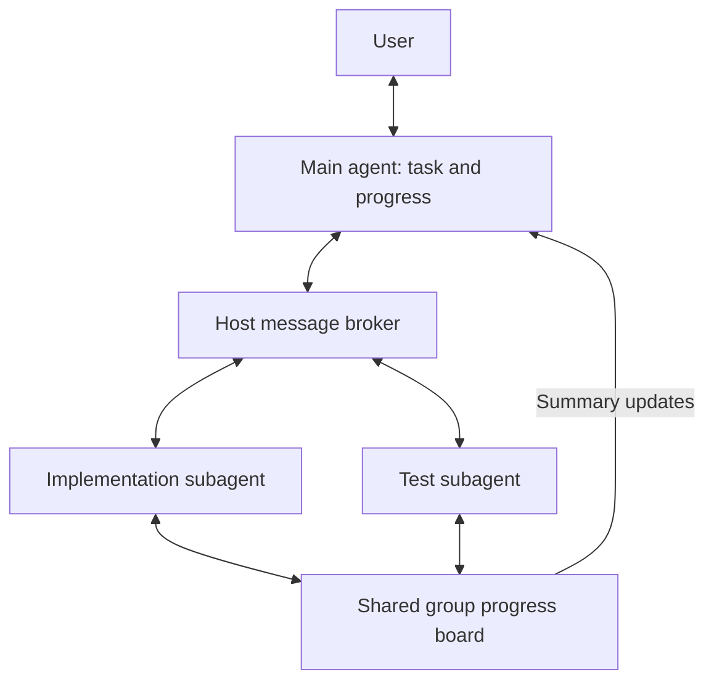
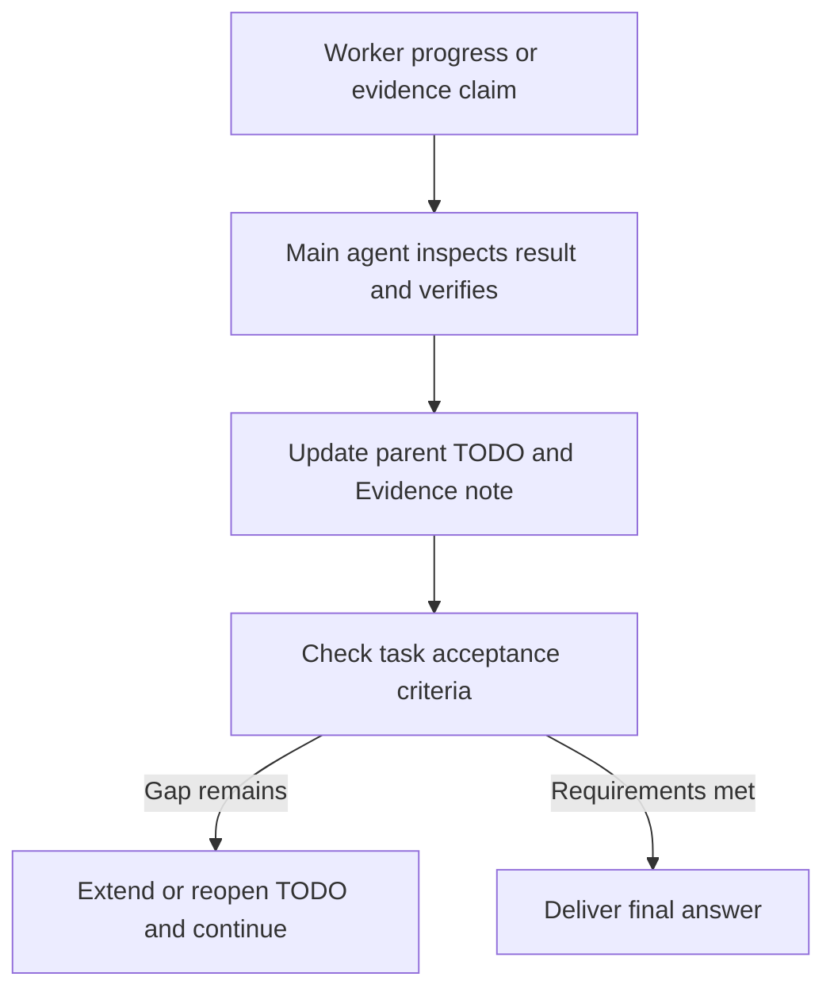

# Agent communication for long tasks

A main agent working through a long refactor may delegate implementation, tests and review, then collect the subagents' results. The communication layer lets those subagents exchange information while their assignments are running and send progress or blockers back to the main agent before they finish.

Subagents use directed messages and a shared progress board. An implementation subagent posts a changed error contract; the test subagent asks it about compatibility and uses the answer in its checks. The main agent follows progress, handles decisions affecting the overall task and checks the combined result. Ferment v2 can keep the main agent working toward an objective. The main agent can also launch a local worker with `ferment_v2: true` to give that worker its own objective and completion checks.

Communication connects to Kimchi's agent creation, user questions, TODOs, review and long-running work. Messages and the board carry worker reports. The parent uses `reconcile_agent_result` to connect completed work and a parent check to an existing TODO. Successful worker TODO writes publish progress to the group board. Receiving a post does not change the reader's TODOs.

## User journey and value

1. The user and main agent agree on the outcome and checks. The main agent keeps visible progress in the task's TODOs or plan.
2. The main agent spawns multiple agents when the situation benefits from it or the user requests it. Each worker gets ownership and checks; tightly coupled work stays sequential.
3. Workers post shared findings, decisions and blockers, and read relevant entries before dependent work. Directed messages carry questions, answers, timely findings and handoffs.
4. The main agent answers or asks the user, checks results and updates the relevant TODO with evidence or a remaining gap.
5. The main agent compares the combined result with the agreed checks and resolves gaps before the final answer. Ferment v2 can automate a continuation check when enabled.

A subagent can use another subagent's discovery before either finishes, and the main agent can respond to a blocker during execution. This may reduce duplicated investigation and rework when the results are combined. The user continues to interact with the main agent.

## Observed results

Isolated built sessions exercised worker TODOs, automatic progress posts, parent board reads and worker-local Ferment objectives. Workers reopened TODOs after changed inputs and replaced stale evidence. Resume testing exposed reuse of an old accepted answer; the fix advances the objective revision. A later probe returned the correct new result within its limit, but Ferment paused because the final wording differed from the accepted draft. Worker results now expose that objective status separately. The [functional test record](worker-goal-evaluation.json) retains these outcomes and limitations. These checks do not measure work-quality improvement.

A four-run comparison then kept TODOs, messages and the board in both arms, changing only worker-local Ferment opt-in. Enabled finals scored 31/31 and 29/31 on frozen behavior checks; controls scored 28/31 and 29/31. All finals passed their own tests, typecheck and formatting. A separate startup check found that the 31/31 output's repair stopped registering uncached tools: it shared one map for discovered names and registered tools. Removing that shared-map argument in a disposable replay restored both startup cases. The frozen grader mocked initialization and missed the regression; its late-warning checks also bypassed a control's alternative implementation. These results do not establish better overall quality or cohesion. Recorded input was 52.0% higher with worker Ferment, output 4.2% lower, including parent and evaluator usage. The [worker quality comparison](worker-goal-quality-evaluation.json) preserves all four attempts, separate diagnostics, capture corrections and limits. It tests Ferment's incremental effect on one reused task, not the value of communication itself.

Live comparisons have demonstrated useful exchanges, but no repeatable improvement in final work quality. The five communication-on/off comparisons summarized below contain twenty built Kimchi runs across three small task families. Each row has two pairs using the same model, task and limits within that comparison. Frozen final behavior scores give eight tied pairs, one win and one loss for enabled communication.

| Comparison | Communication on | Communication off | On: input-token difference | On: output-token difference |
|---|---:|---:|---:|---:|
| Interface implementation | 47/48 | 48/48 | +76.6% | +14.2% |
| Interface with reply recovery | 48/48 | 48/48 | +37.3% | −0.1% |
| Concurrent fetch and cancellation | 94/94 | 94/94 | +112.2% | −3.0% |
| JSON Patch, two implementation owners | 114/114 | 111/114 | +17.7% | +0.5% |
| JSON Patch, implementation owner and reviewer | 114/114 | 114/114 | +0.1% | −3.9% |

Scores sum each row's two final outputs. They are not pooled across tasks. Controls retain shared files and normal parent coordination. All ten enabled finals pass their own tests and typecheck; nine of ten controls do. Additional diagnostics still find defects in both arms, including outputs that pass every frozen check. Code versions and roles vary between rows, and repeated task families are not independent evidence of a general effect. The [data snapshot](evaluation.json) contains pair results, cached-input usage and hashes of the source artifacts. Earlier transcript comparisons and all-enabled before/after probes are outside this table.

A separate comparison on a historical Kimchi routing bug used four complete source snapshots. Communication-on scored 80/82 and 82/82; controls scored 80/82 twice. All four passed their own tests and typecheck, but three missed image safety when Auto routed to a text-only model. A peer type-error report preceded a verified correction in the fully correct run; its image-safety fix was already written before the message. The score difference therefore does not establish a communication benefit. Enabled runs used 31.9% more input tokens and 10.1% fewer output tokens. The [regression data](real-router-evaluation.json) records the four attempts and limitations.

A historical LSP failure comparison found one useful board exchange: after reading an investigator's finding, the owner connected five tools to its failure guard. Replaying that change raised behavior checks from 9/15 to 14/15, with both versions typechecking. Complete enabled outputs scored 28/30 versus 29/30 for controls after correcting overly strict historical message/status wording consistently across all outputs. Enabled runs used 16.5% more input and 12.4% more output tokens. Worker limits, two paused runs and one timed-out run limit the comparison; the [LSP data](lsp-evaluation.json) preserves those outcomes, the original scores and the separate wording correction.

A classifier repair comparison gave both arms two initial workers and one repair worker. Handoffs tied at 67/80; final outputs scored 69/80 with communication and 71/80 without. All four typechecked, but every output retained behavior defects and one final per arm failed its own test command. One owner read a peer finding while its tests reported the same failures; its later repair regressed from 39/40 to 35/40. The [classifier data](classifier-evaluation.json) preserves worker limits, failed attempts, communication traces and completion problems. It provides no final-quality advantage for the board.

An MCP naming repair comparison also found no final-quality advantage. After correcting warning-wording and fixture assumptions uniformly, enabled outputs passed 59/60 behavior checks; controls passed 60/60. A directed peer finding preceded the exact syntax repair in the recipient's next turn; a subsequent board read preceded replacing a duplicate registry with the peer's helper. That output still left a warning helper unused in production. All four finals typechecked. A control stopped at a test-command permission prompt before its repair worker, two other runs paused, and existing OAuth tests were unstable during grading. The [MCP naming data](mcp-names-evaluation.json) preserves original scores, separate diagnostics and all four outcomes; these workflow differences prevent a speed comparison.

A separate comparison kept directed messages and shared files in both arms, removing only board tools and their guidance from one isolated build. Messages plus board scored 33/36 final behavior checks; messages alone scored 34/36. All four finals passed their own tests, typecheck and formatting checks. One reviewer read a board finding and corrected tests afterward, but had already begun those corrections and also received failing test output. The board arm used 9.0% more recorded input and 18.0% more output tokens. These two pairs show no added final-quality benefit from the board. The [board comparison](board-ablation-evaluation.json) preserves the paused runs, recovered handoff captures and channel-use differences.

The clearest value is in specific feedback reaching a worker before a relevant edit. In the cancellation task, a peer reported that rejected callers received Promise objects instead of error values; the owner corrected five paths before its first own-test run. Both comparison arms eventually passed all final behavior checks. In a later all-enabled review run, a board finding exposed an incorrect test expectation. With production and the test set held fixed, the reviewer's corrections changed 63/64 passing tests to 64/64, with both versions typechecking. That library still had a separate production defect.

Shared files also worked without the board: one control corrected failing reviewer tests, and another removed duplicate helpers after reading review notes. Some messages arrived after the reported defect was already fixed. Posts, receipts and reviewer summaries therefore do not establish that communication caused a change; the recipient's observed input and subsequent edits supply that evidence.

The retained tool changes make routing failures visible, provide authorized reply-ID corrections and accept explicit nested reply IDs without weakening host validation. Live probes verify those recovery paths. Extra examples, ownership prose, a pre-validation guard, a duration warning and a flat message schema were tested and removed when their comparisons did not establish the intended benefit. Runtime and readability results remain mixed. Recorded input increased in all five on/off comparisons; output and cache usage varied, so these figures do not establish a general cost saving.

A parent delivery check exposed a separate timing problem: board follow-ups waited until the current run ended. Summaries now refresh through the request-context hook. In one usable old/new pair, the new parent saw a marker before collecting worker results; the old parent saw it only after its first response ended. The [delivery data](parent-board-evaluation.json) retains four invalid setup attempts and two rejected-launch attempts alongside that pair. This establishes earlier delivery in the probe; coding quality remains unproven.

These results support optional communication for a concrete dependency or finding. They do not support forcing posts, adding agents solely to use the board, or promising better quality for every delegated task. Detailed evidence is identified by the run directories in the data snapshot; the cancellation trace is `kimchi-comms-cancel-c2o3tv_k/causal-evidence.json`, and the reviewer-test replay is `kimchi-comms-duration-9j21epyd/review-causal-results.json`.

## Sequential work and delegation

The later [research review](communication-research.md) compares blackboard and information-asymmetry papers with coding teams, scientific research systems and warehouse agents. It identifies workloads and controls that our small repair comparisons have not covered.

Research checked on 2026-09-12. Agent count, execution order and model choice are separate decisions: sequential workers still use multiple agents, and one agent can switch models.

| Source | What it supports | Evidence limit |
|---|---|---|
| [Ahmed's Astra post](https://x.com/ah20im/status/2097503414749909407), September 2026 | Forced multi-agent arrangements can consume quota and worsen results. His [clarification](https://x.com/ah20im/status/2097519690901823752) says to compare the workflow without them; [large parallel investigations](https://x.com/ah20im/status/2097518138522837063) remain a useful case. | Practitioner guidance, not a published controlled comparison. It does not establish that all subagents perform poorly. |
| [Factory: How Missions Work](https://factory.ai/news/missions-architecture), April 10, 2026 | Ordered fresh feature workers, shared artifacts and independent milestone validators. | Architecture and a worked example; no isolated measurement of a progress board's benefit. |
| [Factory: Introducing Missions](https://factory.ai/news/missions) | Reports better results from serial execution with targeted parallelism than broad parallelism. Parallel work remains available within features and validation. | Factory's experience; task-dependent tradeoff remains open. The page displays February 26, 2025, so it is not used to establish recency. |
| [Factory: model routing research](https://factory.ai/news/model-routing-belongs-in-the-harness), August 24, 2026 | Still supports strong parents with efficient focused workers and different models for implementation and review. Reports 58% aggregate production cost reduction from routing. | The savings comparison prices observed calls against frontier-only rates; it does not prove that the same tasks would follow the same trajectory with one model. Its separate benchmarks report 99% and 96% of frontier pass rates at about 20% lower cost per success. |

Messages and a board may reduce coordination work when a task benefits from delegation. A long task with tightly dependent edits may be best handled sequentially; independent investigations or a fresh review are better candidates for delegation.

Factory already has shared state and validation. Kimchi's messages and board let workers ask questions and share discoveries while their assignments are still running. Frequent posts could also add reading, interruptions and rework. Updates that affect another task belong on the board; detailed evidence can stay in artifacts until another agent needs it.

## Things to reuse and integrate

Ordinary sessions, approved plans and Ferment runs can use the same communication tools and task records. The board carries shared discoveries and progress; TODOs track accepted work, and artifacts hold the supporting detail.

| Existing part | What to reuse | Where communication connects |
|---|---|---|
| Agent runtime | Existing spawning, host-owned identities, group membership, messages and board events. | Workers share findings and handoffs within the task. Board summaries refresh in the main agent's request context; directed messages use its existing follow-up channel. |
| User questions and feedback | Worker questions routed through the main agent, with replies associated with their questions. | A developer's decision returns to the affected worker; shared implications can be posted for its peers. |
| TODOs and plans | Existing task references, ownership and pending, in-progress, blocked and completed states. | Workers keep session-local lists, restored from their own journals. Successful writes publish progress snapshots; the main agent verifies results before accepting them into its list. |
| Evidence, review and lessons | Linked checks and artifacts; `Evidence:`, `Decision:` and `Dead-end:` notes. Ferment v2 already retains up to five settled-TODO lessons through its journal. | Verified outcomes inform review and continuation. Worker claims remain distinct from checked results. |
| Ferment v2 | Objective revisions, session journal, completion evaluation and stall checks. | The parent and opted-in workers each evaluate their own objective and TODO evidence. Existing messages carry findings back to the owner. Communication also works without Ferment. |

Existing Ferment mechanisms are described in the [runtime guide](../ferment-v2.md), [lesson extraction](../../src/extensions/ferment-v2/lessons.ts), [progress checks](../../src/extensions/ferment-v2/runtime-policy.ts) and [evaluator](../../src/extensions/ferment-v2/evaluator.ts). The runtime, messaging and TODO sources are linked below.

Whether agents work sequentially or in parallel, the main agent brings their results back into the shared task and checks the combined outcome before claiming completion.

## Messages and the progress board

The [general architecture](README.md#general-architecture) connects delegation, live communication, results and task progress. This example shows two subagents using the communication paths:



`AgentManager` authorizes contact using host-owned identities and group membership. User questions return through the main agent. Replies reference their question; the first authorized answer or decline closes it. Receipts record routing outcomes. The main agent checks task completion separately.

Peer contacts expose `agent_id`, which identifies the recipient of a message. Task IDs remain in host task records and handoff evidence.

A new question or update cannot carry `reply_to`; the tool rejects it with a correction before routing. When a worker mistypes a reply ID, the host can return `openQuestionIds` for questions from that recipient addressed to the caller. The worker selects the intended ID and submits a corrected reply. The rejected attempt sends nothing and leaves questions open.

For an answer or decline, `send_agent_message` accepts the explicit `reply_to` either beside `payload` or inside it. The tool moves a nested ID into the existing host input before validation. Different IDs in both locations are rejected; the tool never chooses a question or changes the recipient.

Failed sends and parent replies appear as tool errors, retaining the host receipt's reason and any recovery details. Accepted queue and resume receipts remain successful tool results; the recipient's work still needs checking.

Denied board reads and posts also appear as tool errors with the host's exact reason. An authorized read of an empty board remains successful. A lone worker has no group board; it can still report to its parent.

Board access requires a queued or running group worker in the active communication root. Finished worker records grant no worker access. The bound parent can read retained entries with `read_agent_board`, supplying the exact `group_id` from its digest. An unknown group returns an error with the parent's available group IDs. Disabling communication clears that root's boards and rejects late reads or posts, so a retained tool capability cannot recreate them.

Workers send specific questions, answers, findings or handoffs through `send_agent_message`. They post findings, decisions and blockers that affect shared work with `post_agent_note`. Peers read relevant entries with `read_agent_board` before dependent work or a handoff that relies on shared assumptions. If a peer needs to act promptly, the author sends the entry ID and needed action directly.

Corrections are follow-up posts. Eligible workers see the board's entry count and latest ID in their next model request, using the same context hook as TODO state. Workers read new entries through the board tool. The main agent's context refreshes with up to three recent titles per group, including author, kind and entry ID. These hints contain no entry bodies and are not saved in session history. A board post does not start a new parent turn or interrupt a running tool. Workers do not need a separate status post after writing TODOs: the host publishes a bounded snapshot with the session and tool-result reference. It includes up to eight items, shortened descriptions and notes. The journal retains full details; later snapshots supersede earlier statuses.

The board is in memory, scoped to one host session and group. Access requires at least two eligible workers batched together, normally background spawns with `communication: "group"`. Retention is bounded and host restart loses the board. Ferment v2's journal does not persist it.

## From worker reports to task progress

A local `Agent` call can set `ferment_v2: true`. Its prompt becomes the worker's objective. The worker uses the existing TODO tools, objective journal, evaluator and continuation checks. Turn, output-token and duration limits still apply; a host stop also cancels an in-flight evaluation. Resuming the worker keeps the same objective ID and advances its revision, so an old accepted answer cannot satisfy the new attempt. Isolated workers and workers tied to a Ferment v1 step cannot enable this mode. The result includes `ferment_v2` with its objective ID, revision, status and last evaluation. A successful worker return does not imply the objective reached `complete`.

Each agent owns its TODOs. Findings travel upward through progress snapshots and worker reports, or back to a worker through messages. The recipient checks the finding and updates its own list. Reopening a TODO removes its previous Ferment lesson; a later verified result can replace it. Board and agent-report tool results are context for evaluation, not citable proof of their claims.

A worker's assignment includes the task reference, owned scope and required check, plus an objective revision when the controller provides one. Board posts can use TODO status words and lesson prefixes independently of Ferment's execution policy. The stored board kinds stay unchanged.

A manually posted finding can add detail beyond the automatic TODO snapshot:

```text
Task 3: in_progress
Decision: preserve the existing error response.
Evidence: focused compatibility tests pass; result in worker report.
Remaining: run the integration check before marking complete.
```

The main agent receives board summaries and reads entries with `read_agent_board(group_id)`. Worker messages, results and artifacts provide further detail. After the worker finishes, it runs a relevant check or reads the resulting artifact in its own session. It then calls `reconcile_agent_result` with `agent_id`, `todo_id` and a note explaining the check. An optional `verification_tool_call_id` selects a particular check; otherwise the tool uses the latest parent `bash` or `read` result.

The tool validates the parent session, successful worker completion and a matching successful check started after that completion. Workers that finish after a soft turn-limit warning (`steered`) are eligible for the same review as other completed workers. Structured reports with unfinished work, unknown references and checks from earlier attempts are rejected. On acceptance, it completes the selected TODO and records the worker attempt and check reference in an `Evidence:` note through the existing TODO store and session result journal. Ferment v2 consumes that same TODO result and retains its evidence lesson when enabled.



With Ferment v2 enabled, its evaluator can cite linked tool results and `Evidence:` lessons. A copied board post still contains the worker's claim. Verification requires inspecting the underlying result or running the relevant check. The retained note records the check, outcome and source reference; decisions and failed approaches have their own labels.

Rejected reconciliation calls return tool errors with the reason and leave the TODO unchanged. The host validates provenance; the main agent judges the relevance and sufficiency of its check. Ordinary TODO tools remain available for direct work and blockers. Ferment v1's judge route and v2's completion evaluator are separate mechanisms.

## Technical references

[Messaging protocol](subagent-communication-protocol.md) · [Board store](../../src/extensions/agents/manager/board.ts) · [Parent board context](../../src/extensions/agents/index.ts) · [TODO storage](../../src/extensions/todos/store.ts) · [Ferment v2 runtime](../../src/extensions/ferment-v2/index.ts)

Source checked on 2026-09-16, based on `52fb3e2c0b0433056a194a309c777618719625a1` with local reconciliation and communication changes.
