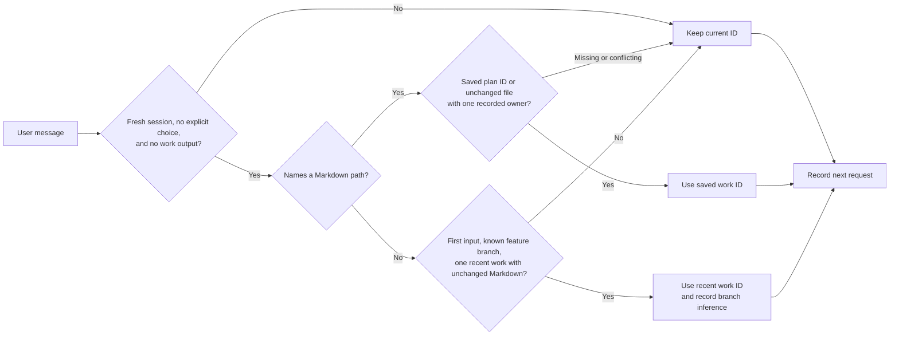
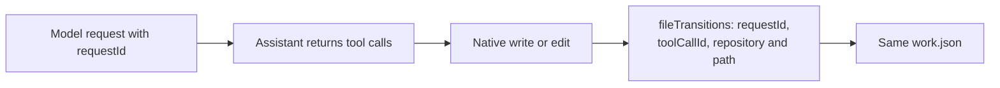
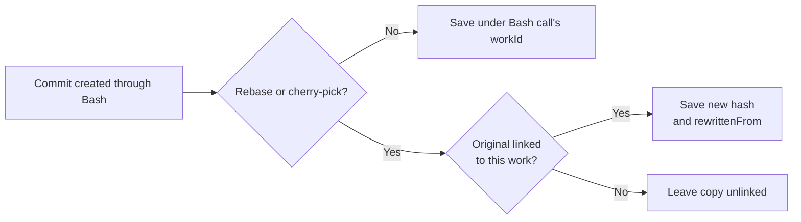
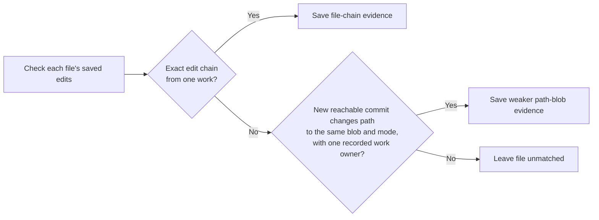
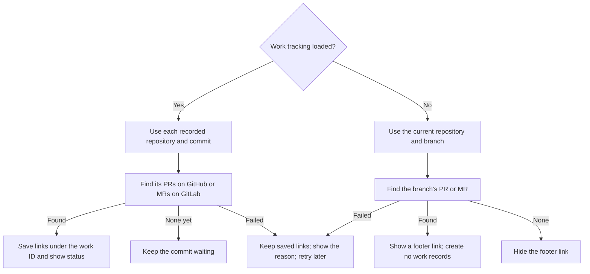

# Work attribution

Kimchi keeps a local record of the model requests, file edits, plans and commits that belong to the same work. A `workId` connects them, even when planning and implementation happen in different sessions or repositories.

The result is `~/.config/kimchi/harness/work/<workId>/work.json` in the user's home directory. Kimchi finds GitHub pull requests and GitLab merge requests for recorded commits and saves those links in the same file. Calculating costs and uploading these records come later.

## Where the files live

**`work.json` is stored per user, outside the project.** All projects use the same `~/.config/kimchi/harness/` directory, with a separate folder for each work ID. `~` means the home directory of the user running Kimchi.

```text
# Project: editable plan
~/src/example/.kimchi/plans/add-search.md

# User: summary and retained plan versions
~/.config/kimchi/harness/work/<workId>/work.json
~/.config/kimchi/harness/work/<workId>/plans/add-search-<content-hash>.md

# User: source history used to rebuild summaries and match later commits
~/.config/kimchi/harness/work-attribution/<session-id>.jsonl
~/.config/kimchi/harness/work-attribution/transitions/<repo-worktree-hash>.jsonl
~/.config/kimchi/harness/work-attribution/ref-tips/<snapshot-hash>.json
```

For example, work `6f102360-39a9-4d6e-8ac7-984c97c0e313` is saved at:

```text
~/.config/kimchi/harness/work/6f102360-39a9-4d6e-8ac7-984c97c0e313/work.json
```

Deleting a worktree removes its editable plan but leaves the user-level summary and retained native plan copies. To continue elsewhere, name the **absolute retained path** shown when Kimchi saved the plan. Ordinary Markdown files, such as ADRs written through a skill, are not copied into this plan folder.

## The usual flow


1. **Start working.** Kimchi creates a work ID and records model requests under it.
2. **Save a plan or write an ADR.** Native plans get retained copies. A Markdown file written through Kimchi's native write/edit tools keeps its work identity in the local edit journal.
3. **Continue in a fresh session.** Name the saved file, for example `Implement docs/adr/search.md`. If you omit the path, Kimchi can continue the one recent work on that feature branch under the rules below. Use `/work new` first when starting an unrelated task.
4. **Implement and commit.** Kimchi adds requests, edits and linked commits to the work's summary. For a native plan in a deleted worktree, use its retained absolute path.

## How Kimchi matches things

### 1. Choose the work ID before the request

CLI and Studio choose the work before sending the request:



- **Named native plan:** reads the work ID saved at the top of the file. Its retained copy works after deleting the original worktree.
- **Named Markdown file:** requires one recorded work owner and the same current Git blob and file mode as the saved edit. A committed ADR can therefore continue work from another worktree. Conflicting or unknown paths prevent automatic selection.
- **No path:** only the first input in a fresh session can use branch inference. Kimchi requires a known non-default branch, exactly one work with recorded edits in that worktree and branch during the last 24 hours, and unchanged Markdown with no competing owner.
- **Keep an explicit choice:** `/work new`, a reopened session, local children and extension-injected input do not automatically switch work. Existing work output also prevents switching. A skill's template paths do not count as user references.

Branch inference is a guess based on recent local activity. An unrelated first message on the same branch can meet those rules, so use `/work new` to keep it separate. The summary records whether continuation came from a saved plan, a named artifact or recent branch activity.

Naming one eligible file can select its work even when asking to compare it. Reading a file through a tool or pasting its contents does not itself establish a link; a fresh session may still qualify for the separate branch rule.

Other cases use these rules:

| Case | Work ID used |
| --- | --- |
| New session with no matching saved work | Creates a new ID. |
| Reopen a session | Restores its current ID. |
| Create a local child or branch the conversation | Inherits the parent's ID when the child is created, or the ID at the branch point. |
| Resume a saved Ferment | Uses the Ferment's saved ID before inference. **Leave paused** keeps the current ID. |
| Choose explicitly | `/work <plan path>` selects that plan's work; `/work new` creates separate work in the same chat. `/work` shows the current ID, PR links and lookup errors. |

Kimchi does not detect later task changes or search other worktrees by filename. One work can span several sessions; one session can contribute to several works.

### 2. Connect each file edit to its model request



One request can produce edits in several repositories. Each edit keeps the ID of the request that produced its tool call, even if another request runs before the file write finishes. The request's `cwd` remains the session's working directory; each edit records the repository and worktree it actually changed.

`fileTransitions` contains these edits in the summary. Old records can have no `requestId`; Kimchi does not invent one. These links support later cost allocation, but edit counts do not determine a price split.

### 3. Link commits to the work that produced them

There are two routes. A commit made through Bash is linked when the command finishes. Background checks find supported external commits in all repositories already known through local edit journals. They run at startup and every 30 seconds while a top-level Kimchi process remains open; reopening the original worktree is not required.

Linked worktrees share a `repository` path pointing to Git's common directory (usually the main checkout's `.git`). Each edit also records its actual `worktree` path, including worktrees outside the main checkout. Git object comparisons can therefore run from the shared `.git` directory.

Failed background Git comparisons remain eligible for a later scan. Attribution diagnostics stay off the terminal, including when debug is enabled. Launch with `NODE_DEBUG=kimchi:work-attribution kimchi` to save them in `~/.config/kimchi/harness/logs/work-attribution.log`. A failed ancestry lookup stays unresolved; only Git's explicit “not an ancestor” result counts as a non-match.

**During a Bash call**



**During background checks**



- **Bash route:** covers new commits, reverts and non-fast-forward merges. Rebase and cherry-pick copies keep the original hash in `rewrittenFrom`.
- **Exact matching is per file.** `file-chain` requires a complete chain from the file's state before the edits to its committed state, with one work owning that chain. Other files in the commit can remain unmatched.
- **Rewritten history has a separate match type.** `path-blob` can find the same resulting file after a rebase, squash, checkout or stash changes its parent history. It requires a new reachable commit that changes that path to the recorded blob and mode, and rejects competing work. Equal content is weaker evidence than an observed edit chain, so the method stays visible in `fileMatches`.
- **`transitionIds` points to the saved edits used as evidence.** For example, Kimchi changes a file from A to B, then you commit it after closing Kimchi. The later scan links that exact change and lists its edit IDs.
- **A commit can have several contributions.** File matches keep each work, session and matched paths. Repeating a commit hash does not create another commit or imply another charge.

New edit records reference a snapshot of the visible Git references and worktree heads to exclude commits that already existed before the edit. Edits share a saved snapshot while those references stay the same. Matching can survive removal of the original linked worktree while the repository and new commit remain available. It cannot recover a repository that was deleted entirely.

### 4. Find pull requests and merge requests

Create the PR or MR through Kimchi, a browser or another tool. Kimchi checks for it at startup and every 30 seconds while open. GitHub and GitLab CLIs are optional: Kimchi reads the provider's API directly and can use their existing credentials.

With work tracking loaded, the match starts with a **repository and commit hash** already saved under a work ID. If work A contains commit `abc123` and the provider returns PR #7 for that commit, Kimchi saves the link under work A. GitLab uses the same flow with merge requests.



Once a link is known, Kimchi also checks that PR or MR by number to refresh its state. Rate-limit responses delay further calls to that host until the retry time.

| Case | How Kimchi finds or keeps the link |
| --- | --- |
| A PR or MR is opened in a browser or another tool | The provider returns it for the recorded commit on a later check. |
| A known PR or MR merges while Kimchi is closed | The next launch refreshes its saved link, including after a squash merge. |
| A commit is rewritten or removed | Kimchi still checks a saved link by number. An empty commit lookup does not erase it. |
| A repository is renamed or transferred | The provider's PR or MR ID keeps one link, with the latest repository name and URL. |
| The provider returns several associations | All returned links are saved, across every result page. |
| Another Kimchi process does the lookup | This session reads the saved result and updates its footer too. |

The footer shows `PR/MR: waiting`, a link such as `PR: #7 open` or `MR: !7 merged`, or `PR/MR: check /work` when lookup fails. The number is a terminal hyperlink; use your terminal's link gesture, usually Cmd-click or Ctrl-click. `/work` lists the current work's links, states, waiting commits and errors. ACP clients receive plain status text and the URL separately; how they display them depends on the client.

Each commit keeps two extra fields:

| Field | Meaning |
| --- | --- |
| `prLookup.status` | `pending` when no PR or MR was found, `linked` after a successful lookup with links, or `error` when the lookup failed. A new commit has no lookup result yet. |
| `prLookup.checkedAt` / `error` | Time and error of the last saved lookup result. Unchanged checks do not append another record. |
| `pullRequests[]` | Confirmed GitHub or GitLab links. The existing field name stays the same for compatibility; later errors do not erase links. |
| `provider` / `number` | `github` uses the PR number; `gitlab` uses the project's MR number (`iid`), not its global ID. Older links without `provider` mean GitHub. |
| `id` / `repositoryId` | Stable provider IDs for the PR or MR and its target repository, when returned. These survive repository renames; older records can omit them. |
| `headSha` / `mergeCommitSha` | The head commit and the provider's merge hash. GitHub may return a test-merge hash before merging; use `state` to establish an actual merge. |
| `mergedAt` / `closedAt` / `checkedAt` | Provider event times, or `null` when unavailable, and when Kimchi checked the link. GitLab's state can be `merged` even when its response omits `mergedAt`. |

Lookup uses no model calls. With work tracking present, commit discovery runs under the existing background worker's lease, with a separate time budget from local Git matching. Deleting the original worktree is supported while the repository's shared Git directory remains available.

Work tracking and PR discovery load as separate extensions. Work tracking saves the commits; PR discovery adds their provider links. Without the PR extension, local work recording and Git matching still run. Without the work-tracking extension, PR discovery shows the current branch's PR or MR. That branch lookup runs its own read-only check; it does not create work records or link costs. Both load by default; this change adds no setting to disable tracking. Removing the work-tracking extension alone would still leave direct tracking calls in other parts of Kimchi.

The PR entrypoint, provider queries and their tests live in `src/extensions/pull-request-status/`.

GitHub's commit-to-PR endpoint may omit a PR that was closed before Kimchi ever found it. Known closed PRs are rechecked so reopening is detected.

Kimchi tries credentials in this order: an environment token for the selected host, a saved Kimchi Git token for that host, then the matching CLI's saved token. It does not prompt, install a CLI, or change your login. A rejected token produces an error instead of silently trying another identity. A `glab` token saved without a host is ignored.

| Available access | Result |
| --- | --- |
| Signed-in `gh` or `glab` | Uses that host's saved token for API reads. |
| Token but no CLI | Uses the token directly. |
| No token and no CLI | Tries public repository access. Private repositories require credentials. |
| No access, network failure or rate limit | Shows the reason and retries later; local request, edit and commit recording continue. |

`GH_TOKEN` or `GITHUB_TOKEN` apply to github.com. GitLab accepts `GITLAB_TOKEN`, `GLAB_TOKEN` or `GITLAB_ACCESS_TOKEN`. Its host comes from `GITLAB_HOST`, then `GL_HOST`, then `GITLAB_URI`; gitlab.com is the default only when none is set. An invalid host disables the environment token. It never falls back to sending that token to gitlab.com. Enterprise GitHub tokens require the matching `GH_HOST`. Saved Kimchi tokens are read by exact host. Credentials never follow a redirect to another host. Anonymous requests have lower rate limits.

### 5. Build the local summary

Before sending a covered model request, Kimchi saves and flushes its request ID, work ID and session ID. It then sends `X-Request-Id`. This also works with telemetry disabled.

Records with the same work ID go into the same `work.json`. Requests are deduplicated by request ID; commit records keep the contributing sessions. `fileTransitions` keeps the recorded edits, and `continuations` explains why another session adopted the work. IDs identify records; array positions have no meaning.

A request record describes an attempt. It does not prove a successful response or give its cost. The work records and retained plan text stay local; `work.json` contains paths, request metadata and PR links, with no prompts, file contents or prices. PR lookup sends repository and commit identifiers to the repository's GitHub or GitLab API.

<details>
<summary>Local files and recovery</summary>

All paths below are inside the agent directory.

| File | What it is for |
| --- | --- |
| `work/<workId>/work.json` | Readable summary of sessions, request attempts, plans, file edits, continuation evidence, commits and PR links. |
| `work/<workId>/plans/<name>-<content-hash>.md` | Saved plan versions that survive worktree deletion. Identical content reuses the same copy. |
| `work-attribution/<session-id>.jsonl` | Append-only history used to rebuild the summary. |
| `work-attribution/transitions/*.jsonl` | Edit evidence: request/tool IDs, repository paths, Git blobs and file modes before and after each native edit/write change. |
| `work-attribution/ref-tips/*.json` | Shared snapshots of the commit references and worktree heads visible when an edit was saved. `historyBoundaryId` identifies the snapshot. |

- Each plan record has `path` for the editable file and `snapshotPath` for its retained version. If saving the retained copy fails, Kimchi warns and leaves the local plan usable.
- Kimchi flushes source records before updating `work.json`. Writers merge under a lock and replace the summary atomically. Shutdown waits for queued summary writes.
- Recovery saves the time of its last successful scan plus each summary's size and modification time. It reads source logs changed since then and skips writing unchanged results.
- A missing or invalid known summary triggers a full replay of the source logs, including edit journals. A failed log read or summary write leaves the checkpoint unchanged. Older summaries remain readable when the new collections are absent.

</details>

<details>
<summary>Request coverage and matching limits</summary>

**Model requests**

- Covers the main model, compaction, permission classification, image descriptions, Ferment evaluation and session naming.
- Background memory capture can combine several sessions, so it is not assigned to one work.
- If saving attribution fails, Kimchi continues and records a diagnostic when debug is enabled. Permission checks still apply, but the records can have gaps.

**Bash commits**

- A conflicted rebase or cherry-pick can continue after a restart. Kimchi caches Git's state-file paths per working directory and reads the files before each Bash call. Continuing through another repository's `git -C` can remain unmatched.
- Bash traces are read line by line, so a trace larger than 8 MiB can still produce commit records. Missing or changed Git history, unreadable or malformed traces and ambiguous concurrent commands can prevent a match.

**Background commit matching**

- Partial staging, later human edits, competing work, Bash/MCP-only edits, unsupported filters and symlinks can leave files unmatched.
- The scan checks up to 512 recent commits within a time budget. Files, journals and logs have 8 MiB limits. Finished candidates are checkpointed; changed evidence allows another attempt.
- `historyBoundaryId` connects an edit to its saved Git reference snapshot. Large snapshots share the journal's size limits; when the required history is unavailable, Kimchi leaves the weaker match unresolved. Old journals can only use the history they actually recorded.
- Top-level sessions in one process share a worker. Separate processes take turns through a nonblocking lease. Children neither start scans nor wait for a parent's scan at shutdown. Closing the last owning session stops its worker; no separate daemon runs after Kimchi exits.

The implementation uses Pi's existing hooks and native Git tracing. It adds no dependency or upstream patch.

</details>

## What still needs work

- **PR costs:** join requests to billing, then decide how to split one work's cost across several PRs.
- **Backend IDs:** verify that the proxy saves the request/session IDs needed for the billing join. The client records do not yet prove that link.
- **Account and repository IDs:** add account IDs and recover stable provider IDs for older links that lack them.
- **Remote agents:** link their requests and returned commits to the local work. Remote sessions are outside this MVP.

<details>
<summary>Current billing and remote-agent limits</summary>

- With telemetry enabled, main requests send the stored Pi session ID as `X-Session-Id`. Session naming, permission classification and image-description calls do not explicitly send that header.
- Matching by session and time still needs verified proxy storage, header coverage for those calls and a way to separate overlapping work in one session. Client request IDs do not yet have a verified match to streaming backend billing rows.
- Remote ACP requests carry a parent-session tag but no work ID. Returned commits bypass Bash tracing. Both are absent from the parent's work summary.

</details>
