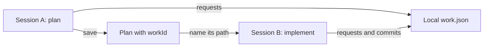
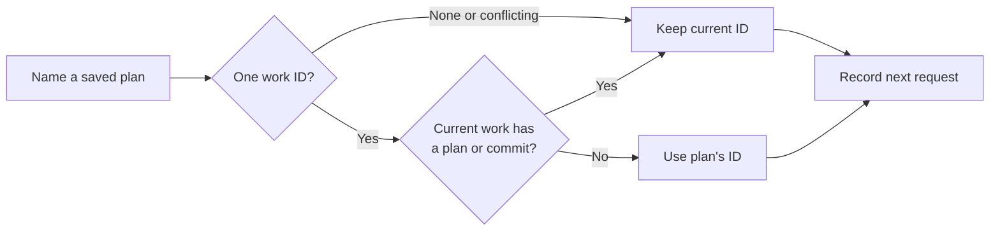
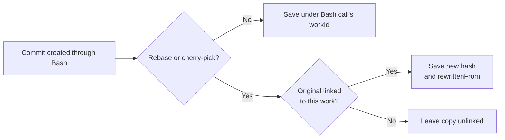
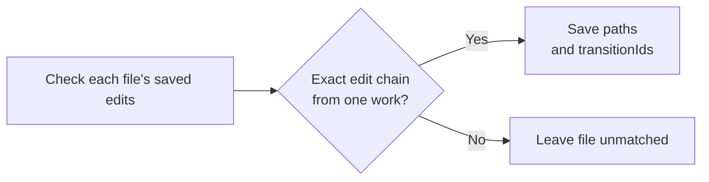

# Work attribution

Kimchi keeps a local record of the model requests, plans and commits that belong to the same work. A `workId` connects them, even when planning and implementation happen in different sessions.

The result is `~/.config/kimchi/harness/work/<workId>/work.json` in the user's home directory. Calculating costs, matching work to PRs and uploading these records come later.

## Where the files live

**`work.json` is stored per user, outside the project.** All projects use the same `~/.config/kimchi/harness/` directory, with a separate folder for each work ID. `~` means the home directory of the user running Kimchi.

```text
# Project: editable plan
~/src/example/.kimchi/plans/add-search.md

# User: summary and retained plan versions
~/.config/kimchi/harness/work/<workId>/work.json
~/.config/kimchi/harness/work/<workId>/plans/add-search-<content-hash>.md

# User: source history used to rebuild summaries and match later commits
~/.config/kimchi/harness/work-attribution/<session-id>.jsonl
~/.config/kimchi/harness/work-attribution/transitions/<repo-worktree-hash>.jsonl
```

For example, work `6f102360-39a9-4d6e-8ac7-984c97c0e313` is saved at:

```text
~/.config/kimchi/harness/work/6f102360-39a9-4d6e-8ac7-984c97c0e313/work.json
```

Deleting a worktree removes its editable plan but leaves the user-level summary and retained plan copies. To continue elsewhere, name the **absolute retained path** shown when Kimchi saved the plan.

## The usual flow



1. **Start working.** Kimchi creates a work ID and records model requests under it.
2. **Save a plan.** It keeps an editable file in `.kimchi/plans/` and saves each version under `work/<workId>/plans/` in the agent directory.
3. **Continue in a new session.** Send `Implement .kimchi/plans/goal.md`. From another worktree, use the retained path shown when saving the plan. That copy survives deletion of the original worktree.
4. **Implement and commit.** Kimchi adds the requests, plan and linked commits to the work's summary.

## How Kimchi matches things

### 1. Choose the work ID before the request

For a user message naming a saved plan, CLI and Studio follow this check:



This reads the work ID saved at the top of the plan. A message comparing one marked plan can also switch the work ID. Pasting plan text or having a tool read the file does not connect sessions. Local children and extension-injected input skip this check.

Other cases use these rules:

| Case | Work ID used |
| --- | --- |
| New session with no saved work | Creates a new ID. |
| Reopen a session | Restores its current ID. |
| Create a local child or branch the conversation | Inherits the parent's ID when the child is created, or the ID at the branch point. |
| Resume a saved Ferment | Uses the Ferment's saved ID before inference. **Leave paused** keeps the current ID. |
| Choose explicitly | `/work <plan path>` selects that plan's work; `/work new` creates separate work in the same chat. `/work` shows the current ID. |

Kimchi does not infer task changes or search other worktrees by filename. One work can span several sessions; one session can contribute to several works.

### 2. Link commits to the work that produced them

There are two routes. A commit made through Bash is linked when the command finishes. A commit made after closing Kimchi can be linked on the next launch in that worktree.

**During a Bash call**



**On the next launch**



- **Bash route:** covers new commits, reverts and non-fast-forward merges. Rebase and cherry-pick copies keep the original hash in `rewrittenFrom`.
- **Later matching is per file.** It requires a complete chain from the file's state before the edits to its committed state, with one work owning that chain. Other files in the commit can remain unmatched.
- **`transitionIds` points to the saved edits used as evidence.** For example, Kimchi changes a file from A to B, then you commit it after closing Kimchi. The later scan links that exact change and lists its edit IDs.
- **A commit can have several contributions.** File matches keep each work, session and matched paths. Repeating a commit hash does not create another commit or imply another charge.

### 3. Build the local summary

Before sending a covered model request, Kimchi saves and flushes its request ID, work ID and session ID. It then sends `X-Request-Id`. This also works with telemetry disabled.

Records with the same work ID go into the same `work.json`. Requests are deduplicated by request ID; commit records keep the contributing sessions. IDs identify records; array positions have no meaning.

A request record describes an attempt. It does not prove a successful response or give its cost. The work records and retained plan text stay local; `work.json` contains paths and metadata, with no prompts, file contents, PR numbers or prices.

<details>
<summary>Local files and recovery</summary>

All paths below are inside the agent directory.

| File | What it is for |
| --- | --- |
| `work/<workId>/work.json` | Readable summary of sessions, request attempts, plans and commits. |
| `work/<workId>/plans/<name>-<content-hash>.md` | Saved plan versions that survive worktree deletion. Identical content reuses the same copy. |
| `work-attribution/<session-id>.jsonl` | Append-only history used to rebuild the summary. |
| `work-attribution/transitions/*.jsonl` | Edit evidence: paths, Git blob IDs and file modes before and after each native edit/write change. |

- Each plan record has `path` for the editable file and `snapshotPath` for its retained version. If saving the retained copy fails, Kimchi warns and leaves the local plan usable.
- Kimchi flushes source records before updating `work.json`. Writers merge under a lock and replace the summary atomically. Shutdown waits for queued summary writes.
- Recovery saves the time of its last successful scan plus each summary's size and modification time. It reads source logs changed since then and skips writing unchanged results.
- A missing or invalid known summary triggers a full replay of the source logs. A failed log read or summary write leaves the checkpoint unchanged.

</details>

<details>
<summary>Request coverage and matching limits</summary>

**Model requests**

- Covers the main model, compaction, permission classification, image descriptions, Ferment evaluation and session naming.
- Background memory capture can combine several sessions, so it is not assigned to one work.
- If saving attribution fails, Kimchi warns and continues. Permission checks still apply, but the records can have gaps.

**Bash commits**

- A conflicted rebase or cherry-pick can continue after a restart. Kimchi caches Git's state-file paths per working directory and reads the files before each Bash call. Continuing through another repository's `git -C` can remain unmatched.
- Missing or changed Git history, ambiguous concurrent commands and oversized traces can prevent a match.

**Matching on the next launch**

- Partial staging, later human edits, competing work, Bash/MCP-only edits, unsupported filters and symlinks can leave files unmatched.
- The scan checks up to 512 recent commits within a time budget. Files, journals and logs have 8 MiB limits. Finished candidates are checkpointed; changed evidence allows another attempt.
- Each top-level session owns its scan. Children neither repeat it nor wait for the parent's scan when shutting down. Closing the owner stops and awaits its own scan.

The implementation uses Pi's existing hooks and native Git tracing. It adds no dependency or upstream patch.

</details>

## What still needs work

- **PR costs:** match work to PRs, join requests to billing, then decide how to split one work's cost across several PRs.
- **Backend IDs:** verify that the proxy saves the request/session IDs needed for the billing join. The client records do not yet prove that link.
- **Account and repository IDs:** add account IDs and stable repository IDs from the Git provider.
- **Remote agents:** link their requests and returned commits to the local work. Remote sessions are outside this MVP.

<details>
<summary>Current billing and remote-agent limits</summary>

- With telemetry enabled, main requests send the stored Pi session ID as `X-Session-Id`. Session naming, permission classification and image-description calls do not explicitly send that header.
- Matching by session and time still needs verified proxy storage, header coverage for those calls and a way to separate overlapping work in one session. Client request IDs do not yet have a verified match to streaming backend billing rows.
- Remote ACP requests carry a parent-session tag but no work ID. Returned commits bypass Bash tracing. Both are absent from the parent's work summary.

</details>

