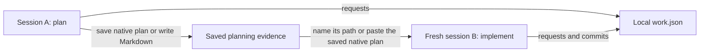
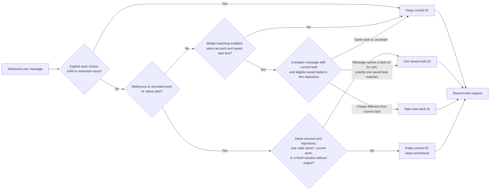
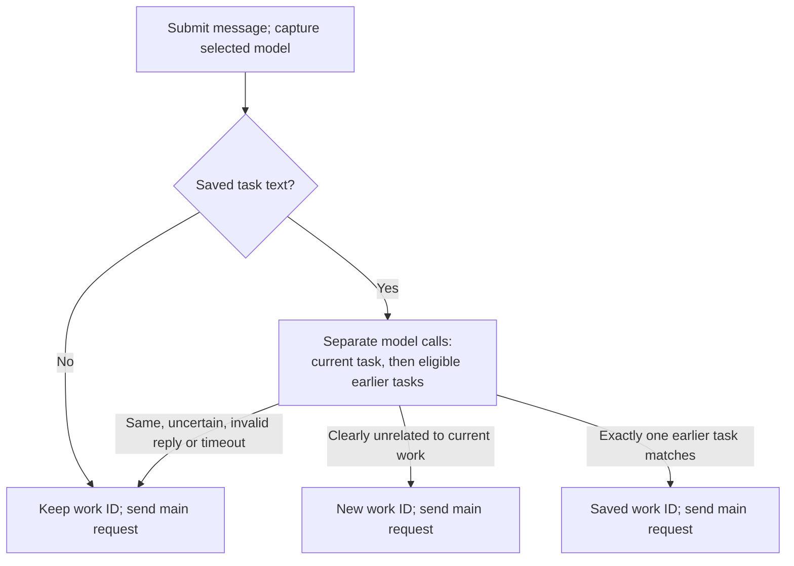
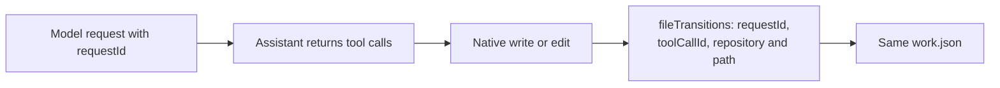
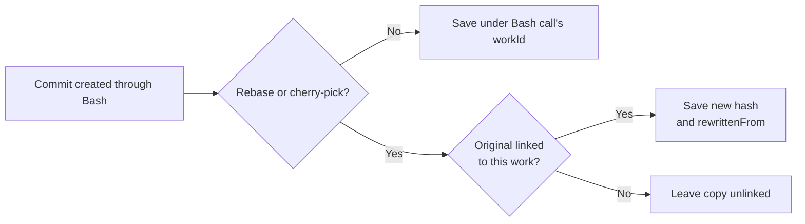
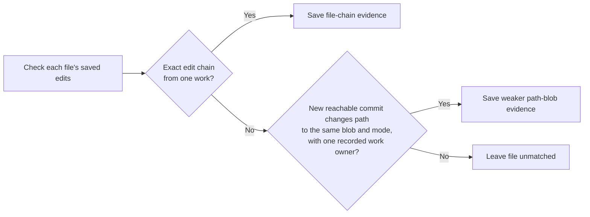
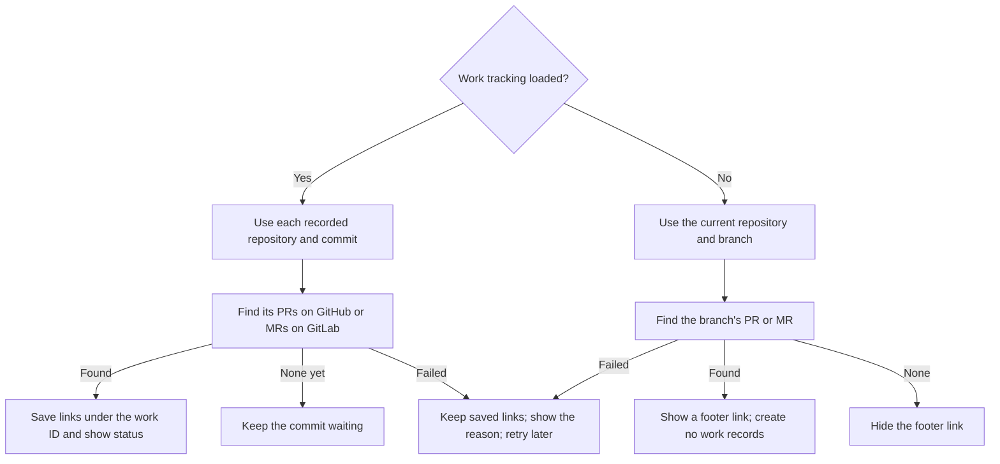
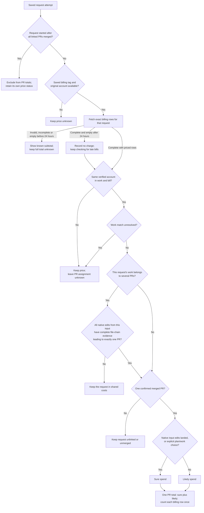

# Work attribution

Kimchi keeps a local record of the model requests, file edits, plans and commits that belong to the same work. A `workId` connects them, even when planning and implementation happen in different sessions or worktrees of the same repository.

The result is `~/.config/kimchi/harness/work/<workId>/work.json` in the user's home directory. Kimchi finds GitHub pull requests and GitLab merge requests for recorded commits, then looks up their request costs in the background. `/work` shows one total split into sure and likely spend, or an open PR's spend so far, plus the work's priced spend; `costs.json` keeps the calculation. Incomplete billing stays unknown. These files are not uploaded.

## Where the files live

**`work.json` is stored per user, outside the project.** All projects use the same `~/.config/kimchi/harness/` directory, with a separate folder for each work ID. `~` means the home directory of the user running Kimchi.

```text
# Project: editable plan
~/src/example/.kimchi/plans/add-search.md

# User: summary and retained plan versions
~/.config/kimchi/harness/work/<workId>/work.json
~/.config/kimchi/harness/work/<workId>/scope.json
~/.config/kimchi/harness/work/<workId>/costs.json
~/.config/kimchi/harness/work/<workId>/plans/add-search-<content-hash>.md

# User: saved task text used for later matching
~/.config/kimchi/harness/work/<workId>/intent.json

# User: source history used to rebuild summaries and match later commits
~/.config/kimchi/harness/work-attribution/<session-id>.jsonl
~/.config/kimchi/harness/work-attribution/transitions/<repo-worktree-hash>.jsonl
~/.config/kimchi/harness/work-attribution/ref-tips/<snapshot-hash>.json
```

For example, work `6f102360-39a9-4d6e-8ac7-984c97c0e313` is saved at:

```text
~/.config/kimchi/harness/work/6f102360-39a9-4d6e-8ac7-984c97c0e313/work.json
```

Deleting a worktree removes its editable plan but leaves the user-level summary and retained native plan copies. To continue elsewhere, name the **absolute retained path** shown when Kimchi saved the plan. Ordinary Markdown files, such as ADRs written through a skill, are not copied into this plan folder.

## The usual flow



1. **Start working.** Kimchi creates a work ID and records model requests under it.
2. **Save a plan or write an ADR.** Native plans get retained copies. A Markdown file written through Kimchi's native write/edit tools keeps its work identity in the local edit journal.
3. **Continue in a fresh session.** Name the saved file, for example `Implement docs/adr/search.md`, or paste a native plan with its work-ID header. Pasted text must match a retained version. If you enabled model matching, a separate call to the selected model can also recognize a paraphrased task. Without matching evidence, the new session keeps its own work ID, even on the same branch.
4. **Implement and commit.** Kimchi adds requests, edits and linked commits to the work's summary. A native plan still works after its original worktree is deleted: use its retained path or paste its saved text.

## How Kimchi matches things

### 1. Choose the work ID before the request

CLI and Studio choose the work before sending the request. A message queued while the agent is responding takes ownership only when delivered. Until then, requests and edits keep the running input's work. A local child keeps the work and input captured when it was spawned, even if it waits in a queue.

For a main-session input, a verified account or repository change starts separate work before these matching rules run. Missing identity prevents automatic adoption of another work.



- **Named native plan:** reads the work ID saved at the top of the file and requires the file to match a locally retained version. Its retained copy works after deleting the original worktree. A plan edited by hand stays unresolved until Kimchi saves it again; `/work <plan path>` still selects it.
- **Pasted native plan:** requires the work-ID header and complete text of a locally retained version. Plain text and Markdown code blocks both work. A changed plan, unknown ID, or conflicting plan stays unresolved. File paths inside the verified plan are its instructions, not additional work selections.
- **Named Markdown file:** requires one recorded work owner and the same current Git blob and file mode as the saved edit. A committed ADR can therefore continue work from another worktree. Mentioning an unowned file, such as `Fix README.md`, is ordinary input. A saved plan mixed with another unresolved path still prevents automatic selection.
- **Separate model check:** when enabled, the model selected when the message is submitted can compare it with saved task text from the same authenticated account and repository. It can continue one earlier task or separate an unrelated question. The branch, worktree and recent activity alone do not establish a link.
- **Keep an explicit choice:** `/work new`, local children and extension-injected input do not automatically switch work. An accepted plan or artifact continuation also keeps the session's later inputs in that work, like `/work <plan>`, including after restart. An input that names a plan or artifact again is checked as usual; one that points to other work stays unresolved and ends this. Restored sessions and existing work output prevent adopting another saved task. Naming a verified plan or artifact from the current work still confirms that input, including after restart. The model check can still start new work for a clearly unrelated message. A skill's template paths do not count as user references.

The summary records whether continuation came from a named plan, pasted plan, named artifact, or a model decision. Pasted-plan evidence points to the retained file. Semantic evidence names the model and decision and saves a hash of the input, without copying its text. Older branch-inference records remain readable; Kimchi does not rewrite their history.

Naming one eligible file can select its work even when asking to compare it. Reading a file through a tool does not select its work. Pasting an ordinary document supplies no exact link; the selected model may still infer one from the user's message. Earlier requests keep their original work IDs. A verified continuation can also confirm the input that produced the selected plan or artifact, as described below.

Other cases use these rules:

| Case | Work ID used |
| --- | --- |
| New session with no matching saved work | Creates a new ID. |
| Reopen a session | Restores its current ID. |
| Create a local child or branch the conversation | Inherits the parent's ID when the child is created, or the ID at the branch point. |
| Resume a saved Ferment | Uses the Ferment's saved ID before inference. **Leave paused** keeps the current ID. |
| Choose explicitly | `/work <plan path>` selects that plan's work unless it belongs to another account or repository; `/work new` creates separate work in the same chat. `/work` shows the current ID, PR links and lookup errors. |

Kimchi does not search other worktrees by filename. One work can span several sessions; one session can contribute to several works.

#### A separate call to the selected model

Model matching is off by default. `/work matching on` allows saved task text to be sent to the selected provider. `/work matching off` cancels a pending comparison without waiting for the main model to finish. The setting is `workSemanticMatching` in `~/.config/kimchi/harness/settings.json`; local tracking and explicit saved-plan continuation work while it is off. This setting does not enable report uploads.

Kimchi captures the model selected when you submit a message, then uses that model for separate matching calls before the main reply. These calls use its normal authentication and provider connection. They have no tools and do not enter the chat history. No local model, extra model setting or `judge` role is required. With no saved task to compare, the first message needs no matching call.

While matching is enabled, the first user message is kept in `work/<workId>/intent.json` after its account is verified. Later checks use that text and the latest retained native plan. Candidates must belong to the same Git repository, API endpoint, organization and authenticated user. Rotating a key for the same account keeps that identity. Missing user identity or legacy text without an account prevents automatic semantic continuation; old text is not assigned to whoever is logged in now. Enabled redaction applies before sending. Raw text and credentials are not copied into `work.json`.

The model checks the current task first. To find earlier work, it first reads the message alone, then compares each eligible saved task separately. Exactly one must match and every competitor must be clearly different. Each check is a separate paid request with its own ID, saved before dispatch. Matching requests stay with the work active before the decision; adopting another work never moves those earlier requests.



Model checks share a three-second limit, including provider authentication and redaction. Account verification has a separate one-second limit and a short in-memory cache. Cancellation, opt-out, account or model changes, a session change or a newer delivered message prevents a late result from changing work. Unresolved references to recorded work are never overridden by a model guess. Explicit choices and local children keep the rules above.

Comparisons stop rather than omit evidence above 256 saved task texts, 32 retained plan versions per work, a latest retained plan over 16,000 bytes or 12,000 serialized input characters. Work directories without saved task text do not count. When any of these limits stops matching, `/work` says so instead of warning on every prompt. Large histories, slow providers and unsupported output formats can therefore remain unresolved. Earlier works without saved task text are not backfilled.

These are model judgments and can be wrong. Each request keeps its input's segment ID, matching method and reason. An uncertain answer preserves the current work ID and marks that input as unknown. Later inputs cannot silently reclassify earlier requests. Cost calculations preserve this uncertainty. `/work new` or `/work <plan path>` gives an explicit choice.

Segments distinguish an explicit plan or work choice, a model inference, ordinary grouping within a session, and an unknown result. Retries, delayed side calls and local children retain their originating segment. Restarting a child restores its saved decision; a historical fork keeps the decision at its fork point. Matching calls have their own `session` segment with `reason: "work-matching"` and `purpose: "work-matching"`; they remain overhead of the work active before the decision. With model matching disabled, ordinary session grouping remains available; its source is recorded as `session`, not as a model decision.

Automatic continuation also requires the same verified account and Git repository. New work saves the API endpoint, organization, user and Git common-directory identity in `scope.json`; requests retain that scope. Another worktree of the same repository can continue it. Switching account or repository starts separate work. Missing account verification, a non-Git directory or an older work without scope prevents automatic adoption; matching then stays unresolved without a warning. `/work <plan path>` refuses a plan whose work was saved for another verified account or repository and keeps the current work. A plan without saved scope remains an explicit local choice; older records are never assigned today's account just because they were reopened.

If account verification is unavailable for a new work's first input, the work keeps waiting for its scope and saves it at the next verified message under the same API key and endpoint; a changed key starts new work instead. Requests made before that stay unscoped. If an existing work's scope file is missing or damaged, the next message starts newly scoped work. An explicit `/work` choice remains selected, with missing scope still unknown. Earlier request records stay unchanged; Kimchi does not fill their missing account data with the current login.

#### Correct earlier requests

Continuing a verified plan or native artifact also checks its producing request. Kimchi confirms the requests from that input under the continued work, whether they were ordinary session work, inferred or unresolved. For example, `Plan docs/new-feature.md` starts as session work; continuing its saved plan later confirms the planning requests automatically. Other inputs in that conversation stay unchanged.

This needs one recorded producer, an unchanged retained plan version or native edit, and matching account/repository scope. Missing or conflicting producer records stay unresolved. An existing correction or revocation takes precedence. The resulting `workLinks` entry names the plan/artifact evidence, producing `requestId` and `segmentId`; no source rows are rewritten. Model guesses do not create these confirmations.

If planning and implementation already ended up in separate works, open the implementing work and run:

```text
/work link <planning-work-id> <planning-segment-id>
```

The planning work's `work.json` lists `requests[].segment.id`. The command selects requests already recorded for that input, including its retries and side calls. Other inputs in the same conversation stay separate. Both works and the selected requests must have matching saved account and repository scope. Older records without that evidence cannot be repaired this way.

If an uncertain input already belongs to the right work, use that current work ID as the source. This records your confirmation without changing its original request or work IDs. `/work unlink <link-id>` also revokes this confirmation.

The command saves a `work_link` revision in the implementing work. It names the selected requests and their intended work; original request and work IDs stay unchanged. The target work's `work.json` keeps these revisions in `workLinks` for cost calculations. Model decisions do not retroactively rewrite earlier requests.

To withdraw it, run `/work unlink <link-id>` in the implementing work. A revoked or conflicting correction leaves the affected assignment unknown until corrected again. Linking those requests from another work replaces the earlier link with a newer revision, including a revoked automatic confirmation. Only the work with the newest revision can then revoke it.

### 2. Connect each file edit to its model request



One request can produce edits in several repositories. Each edit keeps the ID of the request that produced its tool call, even if another request runs before the file write finishes. The request's `cwd` remains the session's working directory; each edit records the repository and worktree it actually changed.

`fileTransitions` contains these edits in the summary. Old records can have no `requestId`; Kimchi does not invent one. These links support later cost allocation, but edit counts do not determine a price split.

### 3. Link commits to the work that produced them

There are two routes. A commit made through Bash is linked when the command finishes. Background checks find supported external commits in all repositories already known through local edit journals. They run at startup and every 30 seconds while a top-level Kimchi process remains open; reopening the original worktree is not required.

Linked worktrees share a `repository` path pointing to Git's common directory (usually the main checkout's `.git`). Each edit also records its actual `worktree` path, including worktrees outside the main checkout. Git object comparisons can therefore run from the shared `.git` directory.

Failed background Git comparisons remain eligible for a later scan. Attribution diagnostics stay off the terminal, including when debug is enabled. Launch with `NODE_DEBUG=kimchi:work-attribution kimchi` to save them in `~/.config/kimchi/harness/logs/work-attribution.log`. A failed ancestry lookup stays unresolved; only Git's explicit “not an ancestor” result counts as a non-match.

While the TUI is active, console output from extensions and dependencies goes to `~/.config/kimchi/harness/logs/tui.log`. The file is private and starts over at 1 MiB. Normal console output returns when the terminal stops, including for an external editor or crash. Plain CLI and Studio output are unchanged.

**During a Bash call**



**During background checks**



- **Bash route:** covers new commits, reverts and non-fast-forward merges. Rebase and cherry-pick copies keep the original hash in `rewrittenFrom`.
- **Exact matching is per file.** `file-chain` requires a complete chain from the file's state before the edits to its committed state, with one work owning that chain. Other files in the commit can remain unmatched.
- **Rewritten history has a separate match type.** `path-blob` can find the same resulting file after a rebase, squash, checkout or stash changes its parent history. It requires a new reachable commit that changes that path to the recorded blob and mode, and rejects competing work. Equal content is weaker evidence than an observed edit chain, so the method stays visible in `fileMatches`.
- **`transitionIds` points to the saved edits used as evidence.** For example, Kimchi changes a file from A to B, then you commit it after closing Kimchi. The later scan links that exact change and lists its edit IDs.
- **A commit can have several contributions.** File matches keep each work, session and matched paths. Repeating a commit hash does not create another commit or imply another charge.

New edit records reference a snapshot of the visible Git references and worktree heads to exclude commits that already existed before the edit. Edits share a saved snapshot while those references stay the same. Matching can survive removal of the original linked worktree while the repository and new commit remain available. It cannot recover a repository that was deleted entirely.

### 4. Find pull requests and merge requests

Create the PR or MR through Kimchi, a browser or another tool. Kimchi checks for it at startup and every 30 seconds while open. An older commit is checked less often, at most daily, and a restart keeps that schedule; a commit still without a PR after 32 days is no longer checked, even when its last lookup failed. Otherwise, a failure that needs your action and was saved by an earlier session is retried once at startup, so a fixed token takes effect without waiting. GitHub and GitLab CLIs are optional: Kimchi reads the provider's API directly and can use their existing credentials.

With work tracking loaded, the match starts with a **repository and commit hash** already saved under a work ID. If work A contains commit `abc123` and the provider returns PR #7 for that commit, Kimchi saves the link under work A. GitLab uses the same flow with merge requests.



Once a link is known, Kimchi also checks that PR or MR by number to refresh its state. Rate-limit responses delay further calls to that host until the retry time.

| Case | How Kimchi finds or keeps the link |
| --- | --- |
| A PR or MR is opened in a browser or another tool | The provider returns it for the recorded commit on a later check. |
| A known PR or MR merges while Kimchi is closed | The next launch refreshes its saved link, including after a squash merge. |
| A commit is rewritten or removed | Kimchi still checks a saved link by number. An empty commit lookup does not erase it. |
| A repository is renamed or transferred | The provider's PR or MR ID keeps one link, with the latest repository name and URL. |
| The provider returns several associations | All returned links are saved, across every result page. |
| Another Kimchi process does the lookup | This session reads the saved result and updates its footer too. |

The footer shows `PR/MR waiting`, a link such as `PR #7 open` or `MR !7 merged`, a count such as `PRs/MRs 2 linked` for several links, or `PR/MR check /work` when lookup fails. A commit no longer checked after 32 days counts as neither waiting nor failed; `/work` says so. Only the number is accented and underlined as the link; when the status line runs out of room, the state goes first (`PR #7`). Before the current work records a commit, it shows the current branch's PR the same way for orientation; its cost is tracked once Kimchi records a commit for it. Kimchi asks GitHub or GitLab about the branch again only after a branch change, a `git push`, `gh pr create` or `glab mr create` run by the agent's Bash tool, or five minutes, and lookup failures for this status stay quiet. This branch lookup, like the branch status without work tracking, asks only the branch's own remote. It therefore does not find a PR or MR opened from a fork to its parent repository. The number is a terminal hyperlink; use your terminal's link gesture, usually Cmd-click or Ctrl-click. `/work` lists the current work's links, states, waiting commits and errors. ACP clients receive plain status text and the URL separately; how they display them depends on the client.

Each commit keeps two extra fields, `prLookup` and `pullRequests[]`. The rows after `pullRequests[]` describe the fields of each saved link:

| Field | Meaning |
| --- | --- |
| `prLookup.status` | `pending` when no PR or MR was found, `linked` after a successful lookup with links, or `error` when the lookup failed. A new commit has no lookup result yet. |
| `prLookup.checkedAt` / `error` | Time and error of the last saved lookup result. Unchanged checks do not append another record; `work-attribution/pr-checks.json` keeps their time. |
| `pullRequests[]` | Confirmed GitHub or GitLab links. The existing field name stays the same for compatibility; later errors do not erase links. |
| `provider` / `number` | `github` uses the PR number; `gitlab` uses the project's MR number (`iid`), not its global ID. Older links without `provider` mean GitHub. |
| `id` / `repositoryId` | Stable provider IDs for the PR or MR and its target repository, when returned. These survive repository renames; older records can omit them. |
| `headSha` / `mergeCommitSha` | The head commit and the provider's merge hash. GitHub may return a test-merge hash before merging; use `state` to establish an actual merge. |
| `mergedAt` / `closedAt` / `checkedAt` | Provider event times, or `null` when unavailable, and when Kimchi checked the link. GitLab's state can be `merged` even when its response omits `mergedAt`. |

Lookup uses no model calls. With work tracking present, commit discovery runs under the existing background worker's lease, with a separate time budget from local Git matching. Deleting the original worktree is supported while the repository's shared Git directory remains available.

Work tracking and PR discovery load as separate extensions. Work tracking saves the commits; PR discovery adds their provider links. Without the PR extension, local work recording and Git matching still run. Without the work-tracking extension, PR discovery shows the current branch's PR or MR. That branch lookup runs its own read-only check and, like the branch status with tracking, asks the provider again only after a branch change, a push or PR creation, or five minutes; it does not create work records or link costs. Both load by default; this change adds no setting to disable tracking. Removing the work-tracking extension alone would still leave direct tracking calls in other parts of Kimchi.

The PR entrypoint, provider queries and their tests live in `src/extensions/pull-request-status/`.

GitHub's commit-to-PR endpoint may omit a PR that was closed before Kimchi ever found it. Known closed PRs are rechecked so reopening is detected.

Kimchi tries credentials in this order: an environment token for the selected host, a saved Kimchi Git token for that host, then the matching CLI's saved token. It does not prompt, install a CLI, or change your login. A rejected token produces an error instead of silently trying another identity. A `glab` token saved without a host is ignored.

| Available access | Result |
| --- | --- |
| Signed-in `gh` or `glab` | Uses that host's saved token for API reads. |
| Token but no CLI | Uses the token directly. |
| No token and no CLI | Tries public repository access. Private repositories require credentials. |
| No access, network failure or rate limit | Shows the reason and retries later; local request, edit and commit recording continue. |

`GH_TOKEN` or `GITHUB_TOKEN` apply to github.com. GitLab accepts `GITLAB_TOKEN`, `GLAB_TOKEN` or `GITLAB_ACCESS_TOKEN`. Its host comes from `GITLAB_HOST`, then `GL_HOST`, then `GITLAB_URI`; gitlab.com is the default only when none is set. An invalid host disables the environment token. It never falls back to sending that token to gitlab.com. Enterprise GitHub tokens require the matching `GH_HOST`. Saved Kimchi tokens are read by exact host. Credentials never follow a redirect to another host. Anonymous requests have lower rate limits.

### 5. Build the local summary

Before sending a covered model request, Kimchi saves and flushes its request ID, work ID, session ID, input segment and account/repository scope. Missing scope is saved as `null`. It then sends `X-Request-Id`. This also works with telemetry disabled.

Records with the same work ID go into the same `work.json`. Requests are deduplicated by request ID; commit records keep the contributing sessions. `fileTransitions` keeps the recorded edits, `continuations` explains why another session adopted the work, and `workLinks` keeps correction revisions. IDs identify records; array positions have no meaning.

A request record describes an attempt. It does not prove a successful response or a charge. Covered HTTP replies add their status and safe response IDs. Billing lookups later add exact prices when available. `work.json` contains paths, request metadata, PR links and billing rows, with no prompts or file contents. Retained native plans contain the plan text and stay local. PR lookup sends repository and commit identifiers to the repository's GitHub or GitLab API.

<details>
<summary>Local files and recovery</summary>

All paths below are inside the agent directory.

| File | What it is for |
| --- | --- |
| `work/<workId>/work.json` | Readable summary of sessions, request attempts, plans, file edits, continuation evidence, commits and PR links. |
| `work/<workId>/costs.json` | Derived PR totals and each request's allocation, price and billing lookup status. Rebuilt from source records when missing. |
| `work-attribution/billing-polls.json` | Latest polling times and the last refresh that failed before any billing page. Replaced after checks, so unchanged results and failed refreshes do not grow the journal. |
| `work/<workId>/scope.json` | Original API endpoint, organization, user and Git common-directory identity. Credentials are not saved here. |
| `work/<workId>/intent.json` | Saved task text for opt-in model matching, bound to its original account and repository. |
| `work/<workId>/plans/<name>-<content-hash>.md` | Saved plan versions that survive worktree deletion. Identical content reuses the same copy. |
| `work-attribution/<session-id>.jsonl` | Append-only history used to rebuild the summary. |
| `work-attribution/transitions/*.jsonl` | Edit evidence: request/tool IDs, repository paths, Git blobs and file modes before and after each native edit/write change. |
| `work-attribution/ref-tips/*.json` | Shared snapshots of the commit references and worktree heads visible when an edit was saved. `historyBoundaryId` identifies the snapshot. |
| `work-attribution/pr-checks.json` | When each recorded repository and commit was last checked for a PR or MR, including checks whose unchanged result was not appended. A restart therefore keeps the lookup schedule. Kimchi replaces the file at most once per pass and only after a change. It drops entries for commits it no longer records and for checks more than a day old. Deleting it costs at most one extra check per commit. |

- Each plan record has `path` for the editable file, `snapshotPath` for its retained version and `contentHash` to detect changes. Plans produced by an attributed tool also name its `requestId`. If saving the retained copy fails, Kimchi shows a warning and leaves the local plan usable. Naming or pasting that plan later then does not continue its work or confirm its producing input; `/work <plan path>` still selects it.
- Kimchi flushes source records before updating `work.json`. Writers merge under a lock and replace the summary atomically. Shutdown waits for queued summary writes.
- Recovery saves the time of its last successful scan plus each summary's size and modification time. It reads source logs changed since then and skips writing unchanged results.
- A missing or invalid known summary triggers a full replay of the source logs, including edit journals. A failed log read or summary write leaves the checkpoint unchanged. Older summaries remain readable when the new collections are absent.

</details>

<details>
<summary>Request coverage and matching limits</summary>

**Model requests**

- Covers the main model, compaction, permission classification, image descriptions, Ferment evaluation and session naming.
- Background memory capture can combine several sessions, so it is not assigned to one work.
- If saving attribution fails, Kimchi continues and records a diagnostic when debug is enabled. Permission checks still apply, but the records can have gaps.

**Bash commits**

- A conflicted rebase or cherry-pick can continue after a restart. Kimchi caches Git's state-file paths per working directory and reads the files before each Bash call. Continuing through another repository's `git -C` can remain unmatched.
- Bash traces are read line by line, so a trace larger than 8 MiB can still produce commit records. Missing or changed Git history, unreadable or malformed traces and ambiguous concurrent commands can prevent a match.

**Background commit matching**

- Partial staging, overlapping human edits, competing work, Bash/MCP-only edits, unsupported filters and symlinks can leave files unmatched.
- The scan checks up to 512 recent commits within a time budget. Files, journals and logs have 8 MiB limits. Finished candidates are checkpointed; changed evidence allows another attempt.
- `historyBoundaryId` connects an edit to its saved Git reference snapshot. Large snapshots share the journal's size limits; when the required history is unavailable, Kimchi leaves the weaker match unresolved. Old journals can only use the history they actually recorded.
- Top-level sessions in one process share a worker. Separate processes take turns through a nonblocking lease. Children neither start scans nor wait for a parent's scan at shutdown. Closing the last owning session stops its worker; no separate daemon runs after Kimchi exits.

The implementation uses Pi's existing hooks and native Git tracing. It adds no dependency or upstream patch.

</details>

### 6. Read exact request costs

Kimchi adds a unique `kimchi-request:<requestId>` tag to each covered HTTP attempt. It saves the tag and the original billing source before sending the request. The existing billing API can then return that attempt's charged rows, including for streaming requests. No backend deployment is needed for this tag lookup.

The tag identifies the request; it does not decide which PR owns the cost. That decision uses the recorded work and commit links. Kimchi does not use token estimates, session timing or local model rates as a substitute for a billed price.



Planning, implementation, local children and fixes count together when their saved work links point to the same PR. Related discussion also counts when it belongs to that work, even if it changes no files. Two works contributing to one PR produce one combined total only when their API endpoint, organization and user match. Different accounts get separate totals. Separate works in one conversation keep their own PR links and costs. A malformed PR link affects only its own work. Repeating a lookup, rebasing a commit or rebuilding the summary does not multiply its charges.

Sure spend includes the requests from an input whose own native edits landed in that PR, plus explicit plan, work and correction choices. Other session inputs and model matches are likely spend. An input can include several requests and local children; they keep the same confidence when their complete edit evidence belongs to one PR.

When one work spans several PRs, every recorded native edit from an input must lead to one PR to confirm that assignment. Planning without edits, an input touching both PRs, missing or conflicting proof, and weaker `path-blob` evidence stay shared. Kimchi never divides one request's charge by file count or a guessed percentage. Rewrite ancestry alone cannot establish an exclusive allocation.

Pending prices are checked after 30 seconds, slowing to five minutes after a day. Priced requests are checked after five minutes; settled no-charge attempts after an hour. Each pass has time and request limits, so a backlog can take several passes. Polling stops once a lookup at or beyond the end of the fixed 32-day window reaches the billing API. Kimchi records that final result in the journal even when it is unchanged. A late launch can make that final check; one that fails before any billing page is retried hourly. Polling times survive restarts without adding unchanged billing rows to the journal. `/work` reads the saved result without waiting for the network.

Prices are USD decimal strings with up to nine decimal places. `knownCostUsd` is the known subtotal; `totalCostUsd` includes sure and likely spend and is `null` while required prices or PR ownership remain unresolved. `explicit` and `inferred` hold the two portions. An explicit billed zero is valid. A complete empty lookup also settles to zero once the attempt is 24 hours old, with `billingLookup.status: "no-charge"` and no invented billing ID. Errors, incomplete pages and missing account evidence cannot settle a request. A later bill replaces the zero.

An exact price does not confirm a model's task match. Likely requests remain listed under `inferredRequestIds` and in the `inferred` cost portion. `/work` shows the combined total and its sure/likely split. Shared requests stay outside individual PR totals. Requests started after all linked PRs merged also stay outside those totals, including when their billing or task match is unresolved.

A refresh that fails before any billing page arrives adds no evidence. This covers being offline, DNS or TLS errors, a failed API key check, an HTTP error such as 429 or 5xx on the first page, and Kimchi's pass deadline. The last confirmed price stays usable and nothing is added to the journal. `billing-polls.json` keeps the failure, the request's `billingLookup` in `costs.json` shows it with its real timestamp, and `/work` says that the last refresh failed. Errors after the first page, including partial pagination, keep the full total unknown. Failure records saved by earlier versions also stay unknown until a complete lookup succeeds, because they do not record whether a page had arrived; their pass-deadline records marked as happening before any page are the exception.

Billing details appear on the matching `work.json` request. This excerpt uses example IDs; comments explain the fields and are not part of the stored JSON:

```jsonc
{
  // Kimchi's unique ID for this HTTP attempt.
  "requestId": "11111111-1111-4111-8111-111111111111",
  // The input this request belongs to, and the evidence for its work assignment.
  "segment": {
    "id": "22222222-2222-4222-8222-222222222222",
    // explicit, inferred, session, or unknown; an exact price does not strengthen this evidence.
    "attribution": "explicit",
    "reason": "saved-plan"
  },
  // Saved before sending; the tag selects this attempt's billing rows.
  "billingSelector": {
    "type": "tag",
    "tag": "kimchi-request:11111111-1111-4111-8111-111111111111",
    // Fixed query bounds allow charges to arrive after the stream ends.
    "startTime": "2026-10-02T09:55:00.000Z",
    "endTime": "2026-11-03T10:00:00.000Z"
  },
  "response": {
    "status": 200,
    "receivedAt": "2026-10-02T10:00:01.000Z"
  },
  "billingRows": [
    {
      // Stable billing-row ID; repeated observations count once.
      "id": "33333333-3333-4333-8333-333333333333",
      // Exact backend price, preserved without floating-point rounding.
      "costUsd": "0.000166000",
      // The billed model can differ from the model requested by the session.
      "model": "glm-5.3-flash",
      // Raw billed counters stay exact strings. Cache reads are separate here.
      "promptTokens": "1000",
      "completionTokens": "20",
      "cacheReadInputTokens": "200",
      "totalTokens": "1020",
      // These explain costUsd; they are not added to it again.
      "promptPrice": "0.000150000",
      "completionPrice": "0.000010000",
      "cacheReadPrice": "0.000006000",
      "cacheCreationPrice": "0.000000000"
    }
  ],
  "billingLookup": {
    "status": "priced",
    "checkedAt": "2026-10-02T10:00:30.000Z",
    // Organization verified for the credential that made the request.
    "organizationId": "44444444-4444-4444-8444-444444444444",
    // Verified API-key owner; required to assign the bill to scoped work.
    "userId": "55555555-5555-4555-8555-555555555555"
  }
}
```

The request also keeps the API and gateway addresses and a one-way credential fingerprint in `billingSource`. Kimchi uses them to avoid querying another account after a login or endpoint change; it never saves the credential itself in work records. After a key change, older requests become `account-changed` when refreshed. Saved prices still contribute to the known subtotal, but the full total stays unknown until the original source is available again. Billing calls send the request tag and account scope, without plans, prompts, file contents, work IDs or PR data.

The verified billing account must also match the request's saved work account. If the account changes between choosing work and sending the request, the exact billed charge remains visible but its PR assignment becomes unknown. Missing user identity or old requests without saved work scope also remain unassigned. Kimchi never fills that gap with the current login.

Each PR total in `costs.json` has an `account` alongside its canonical `key`. Compare both fields when combining reports. `account: null` means the work account could not be established. If an older work contains several account groups for one PR, `/work` labels those groups separately.

The gateway accepts ten combined tags across the body and headers. Kimchi preserves existing tags and skips its billing tag when the request is full, uses the reserved tag already, or has a body it cannot safely inspect. The skip reason stays in the request record. A request without the tag stays unpriced (unknown); a captured `X-Prompt-Id` is diagnostic only and never selects a bill. Old untagged requests cannot be recovered from timestamps alone.

The lookup window stays fixed from 12 hours before dispatch, which tolerates a fast local clock, to 32 days after it. This fits the API's time-range limit and includes delayed reports; the UUID tag still supplies the exact match. A charge outside that window or no longer retained by the backend stays unknown.

When the API supplies them, each billing row also retains token counters, price components, model/provider details and the report time. Original and recommended prices are comparisons, not extra charges. Missing fields stay absent; `metadataUnavailable` names optional fields rejected as malformed. Prompt previews and arbitrary response fields are not stored.

Saved records can be recalculated offline. An air-gapped client still needs actual billing observations to know a charge; token counts or a current price page cannot establish a missing historical price. Keeping the original counters and components allows later checks without changing the original work or request IDs.

The footer and Ferment budgets have different token scopes. Ferment V2 counts parent turns, while children and evaluation have their own requests. Local model rates can be zero even for billed requests. The work total uses the API's charged USD, including the price components already included in each returned total.

## Turning Cost per PR off

Cost per PR is listed in `/resources` like other built-in extensions and is on by default. Disabling it there, or with `kimchi resources disable extensions.cost-per-pr`, takes effect at the next start: Kimchi records no work, looks up no PRs and shows no `/work` or PR/MR status. Other extensions stop recording work at once. Records already saved stay on disk.

## What still needs work

- **Shared costs:** planning and requests without complete exclusive edit evidence stay shared when the work spans several PRs.
- **Missing request identity:** older untagged attempts and requests whose billing tag had to be skipped stay unpriced.
- **Stable repository IDs:** recover stable provider IDs for older links that lack them.
- **Historical repair:** old records without account or producer evidence stay unresolved. Automatic replay of newly available evidence is still separate work.
- **Remote agents:** link their requests and returned commits to the local work. Remote sessions are outside this MVP.

<details>
<summary>Current billing and remote-agent limits</summary>

- With telemetry enabled, main requests send the stored Pi session ID as `X-Session-Id`. Session naming, permission classification and image-description calls do not explicitly send that header.
- Cost lookup uses only the saved request tag. A request without a tag stays unpriced (unknown). A failed attempt can still have a charge. Complete empty lookups settle under the 24-hour rule above. HTTP capture covers chat-completions, Responses and Anthropic messages. WebSocket requests need separate coverage.
- Remote ACP requests carry a parent-session tag but no work ID. Returned commits bypass Bash tracing. Both are absent from the parent's work summary.

</details>
